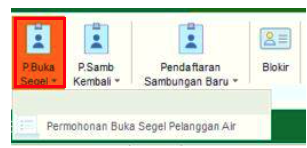
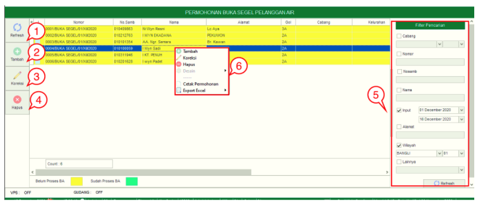
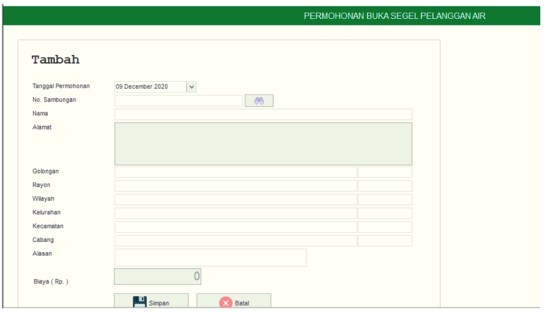

= Mengelola Permohonan Pembukaan Segel Pelanggan

Fitur *Permohonan Buka Segel Pelanggan Air* meliputi *Tombol Refresh*, *Tambah*, *Koreksi*, *Hapus*, *Kolektif MBR*, *Filter Pencarian*, dan *Action Button*. Berikut adalah detail fitur *Permohonan Buka Segel Pelanggan Air*  : 

1. *Refresh Permohonan Buka Segel Pelanggan Air*
+
Tombol *Refresh* digunakan untuk memperbarui data *Permohonan Buka Segel Pelanggan Air* yang mungkin belum masuk ketika data sudah di-_submit_

2. *Tambah Permohonan Buka Segel Pelanggan Air*
+
Tombol *Tambah* digunakan untuk menambah data baru Permohonan Buka Segel Pelanggan Air. Berikut cara untuk menambah data baru *Permohonan Buka Segel Pelanggan Air*: 
+

+
- Lengkapi *form yang tersedia* untuk menambahkan data baru pada Permohonan Buka Segel Pelanggan Air. Kemudian klik tombol *Simpan*

3. *Koreksi Permohonan Buka Segel Pelanggan Air*
+
Tombol *Koreksi* digunakan untuk melakukan koreksi pada data  *Permohonan Buka Segel Pelanggan Air*. Untuk melakukan Koreksi, Anda dapat memilih data pada daftar, kemudian klik tombol *Koreksi*.

4. *Hapus Permohonan Buka Segel Pelanggan Air*
+
Tombol *Hapus* digunakan untuk menghapus data *Permohonan Buka Segel Pelanggan Air* dalam _List_. Untuk menghapus data, Anda dapat memilih data pada daftar, kemudian klik tombol *Hapus*.

5. *Filter Pencarian Permohonan Buka Segel Pelanggan Air*
+
Field *Filter* digunakan untuk mencari data *Permohonan Buka Segel Pelanggan Air* esuai dengan kebutuhan. Untuk melakukan pencarian data, Anda dapat mengisi _form_ sesuai dengan _field_ yang sudah ditentukan kemudian klik tombol *Refresh*.

6.*Action Menu saat diklik kanan*
+
Anda dapat melakukan klik kanan pada _row_ data Permohonan Buka Segel Pelanggan Air untuk menampilkan _action menu_. Berikut adalah penjelasan untuk masing-masing _action menu_: 

- *Tambah* : Untuk menambah data Permohonan Buka Segel Pelanggan Air Baru
Koreksi : Untuk melakukan koreksi (edit) terhadap data Permohonan Buka Segel Pelanggan Air yang dipilih

- *Hapus* : Untuk menghapus pada data Permohonan Buka Segel Pelanggan Air yang dipilih

- *Cetak Permohonan* : untuk mencetak bukti pembayaran Permohonan Buka Segel Pelanggan Air yang dipilih

- *Surat Pemberitahuan Pembayaran RAB (SPPRAB)* : untuk menampilkan dan mencetak SPPRAB pada data Permohonan Buka Segel Pelanggan Air yang dipilih

- *Surat Pemberitahuan Pembayaran Rekening (SPA)* : untuk menampilkan dan mencetak SPA pada data Permohonan Buka Segel Pelanggan Air yang dipilih

- *Export Excel* : Untuk melakukan _export_ data Permohonan Buka Segel Pelanggan Air berupa _file_ Excel