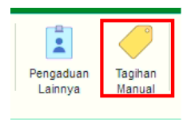
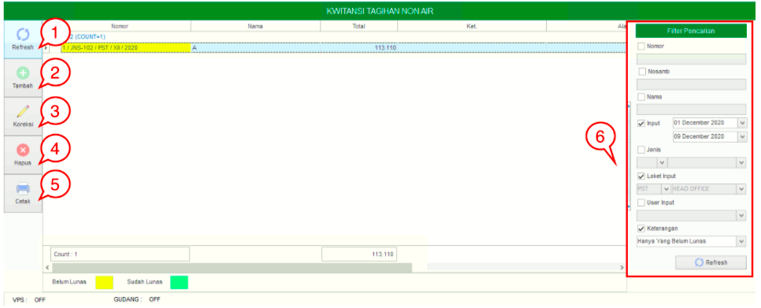
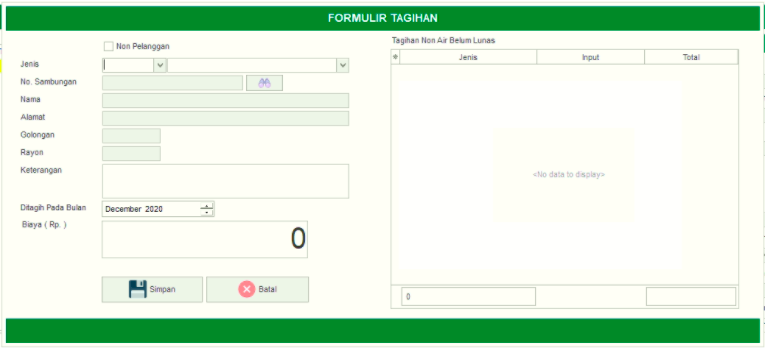

== Mengelola Tagihan Secara Manual

Fitur ini bisa disambungkan otomatis dengan *Loket* untuk memunculkan informasi tagihan berdasarkan jenis yang dipilih. Pada menu ini, pengguna dapat menambahkan tagihan secara manual dengan cara mengisi *formulir tagihan*. Ada 6 action _button_ pada fitur ini, meliputi *Refresh*, *Tambah*, *Koreksi*, *Hapus*, *Cetak*, dan *Filter Pencarian*. Berikut untuk _detail_ penjelasan _action_ yang ada pada fitur *Tagihan Manual* :

1. *Refresh Tagihan Manual*
+
Tombol *Refresh* digunakan untuk memperbarui data *Tagihan Manual*  yang mungkin belum masuk ketika data sudah di-_submit_.

2. *Tambah Tagihan Manual*
+
Tombol *Tambah* Tagihan Manual  digunakan untuk menambah data baru tagihan secara manual. Berikut cara untuk menambah data baru *Tagihan Manual* : 
+

+
[arabic]
. Lengkapi *form yang tersedia* untuk menambah data baru Tagihan Manual. 
. Kemudian klik Tombol *Simpan* untuk menambah data baru yang sudah diisi.

3. *Koreksi Tagihan Manual*
+
Tombol *Koreksi* digunakan untuk melakukan koreksi pada data *Tagihan Manual*. Untuk melakukan Koreksi, Anda dapat memilih data pada daftar, kemudian klik tombol *Koreksi*.

4. *Hapus Tagihan Manual*
+
Tombol *Hapus* digunakan untuk menghapus data *Tagihan Manual*  dalam List. Untuk menghapus data, Anda dapat memilih data pada daftar, kemudian klik tombol *Hapus*.

5. *Cetak Tagihan Manual* 
+
Tombol *Cetak* digunakan untuk mencetak list data *Tagihan Manual*. Untuk mencetak data bisa dilakukan dengan cara klik tombol *Cetak*.

6. *Filter Pencarian Tagihan Manual*
+
_Field_ *Filter* digunakan untuk mencari data *Tagihan Manual*  sesuai dengan kebutuhan. Untuk melakukan pencarian data, Anda dapat mengisi _form_ sesuai dengan _field_ yang sudah ditentukan, kemudian klik tombol *Refresh*.