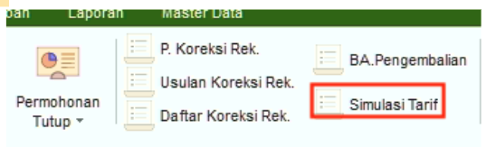
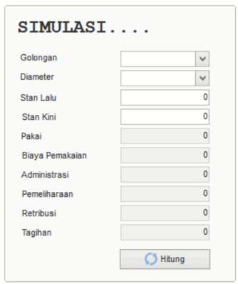

= Menghitung Simulasi Tarif

Fitur *Simulasi Tarif* digunakan untuk membuat perkiraan tarif yang akan dibayarkan oleh pelanggan dengan cara memasukkan *Informasi Golongan, Diameter, Stan Lalu*, dan *Stan Kiri*. Fitur ini hanya bisa dipakai sebelum pelanggan resmi mendaftar di PDAM.

