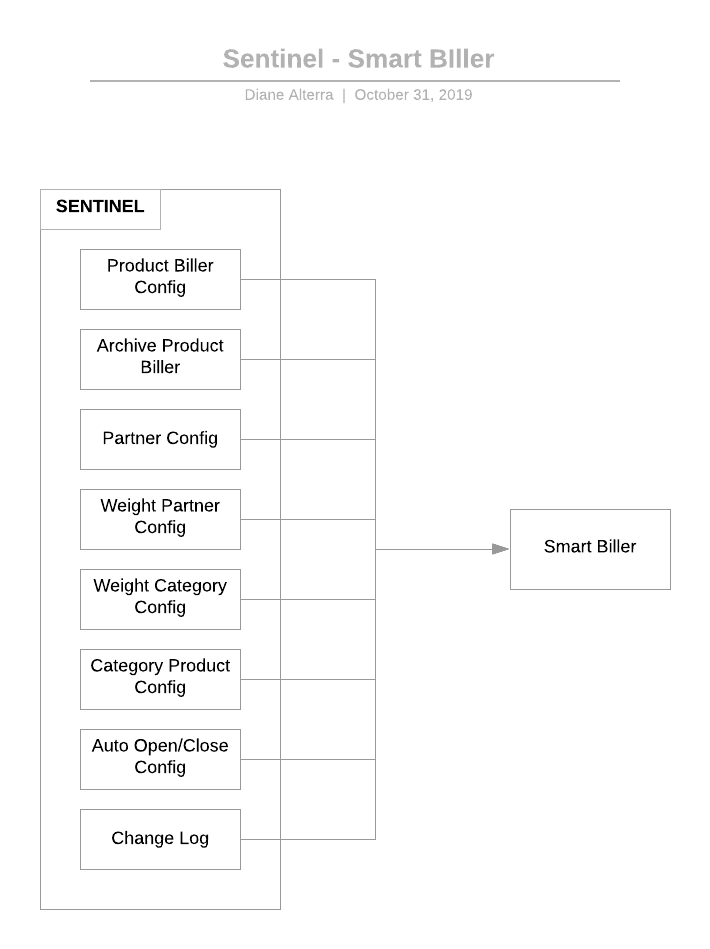

= Smartbiller Sentinel

Informasi terkait implementasi Smartbiller pada Sentinel.

Dari gambar _high-level_ untuk Smartbiller di atas dapat dijabarkan sebagai berikut:

. Sentinel menggunakan _API key_ yang disediakan oleh Smartbiller untuk melakukan _request_ ke sistem Smartbiller.
. Terdapat 8 konfigurasi yang bisa diubah oleh Sentinel, yaitu:
+
a. *Product Biller Config*: Konfigurasi Product Biller dengan fungsi untuk menonaktifkan/ mengaktifkan produk. Artinya produk tersebut akan/tidak akan disertakan dalam kalkulasi Smartbiller, serta terdapat _archive/unarchive_ pada produk tersebut.
+
b. *Archive Product Biller*: Halaman untuk menampilkan Product Biller yang sudah di-_archive_, serta terdapat fitur untuk _unarchive_ Product Biller tersebut.
+
c. *Partner Config*: Konfigurasi Product Per Partner dimana terdapat fungsi untuk menyertakan produk dalam kalkulasi Smartbiller atau tidak.
+
d. *Weight Partner Config*: Konfigurasi parameter bobot untuk tiap partner kraken yang akan mempengaruhi perangkingan Smartbiller terhadap partner
+
e. *Weight Category Config:*: Konfigurasi parameter bobot untuk tiap kategori produk kraken yang akan mempengaruhi perangkingan Smartbiller terhadap kategori produk
+
f. *Category Product Config:*: Konfigurasi untuk _mapping_ produk berdasarkan kategori.
+
g. *Auto Open/Close Config:*: Konfigurasi Open/Close untuk _repetitive failed transaction_.
+
h. *Change Log:*: Halaman untuk menampilkan semua _log_ perubahan yang ada pada konfigurasi Partner Product.
