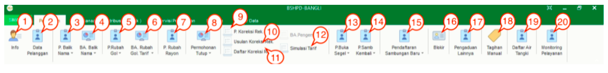

= Menu Modul Hublang

Berikut deskripsi secara umum dari menu yang ada pada Hublang : 

== Menu Pelayanan

1. Ikon *Info* menyediakan info mengenai data dari pelanggan dan menyediakan menu yang dapat melihat data dari pelanggan secara detail, yaitu *Data Pelanggan*, *Histori Pembacaan Meter*, *Tagihan*, *Histori Pembayaran*, *Histori Berita Acara*, *Foto Rumah*, dan *Denah Sambungan Baru*.

2. Ikon *Data Pelanggan* menyediakan menu untuk melihat data pelanggan dan koreksi data pelanggan.

3. Ikon *Permohonan Balik Nama* dapat digunakan untuk menampilkan, mengoreksi, dan menghapus data permohonan balik nama, serta menambahkan permohonan balik nama baru.

4. Ikon *Berita Acara Balik Nama* dapat digunakan untuk menampilkan, mengoreksi, dan menghapus berita acara balik nama yang telah dibuat sebelumnya, serta menambahkan berita acara balik nama baru.

5. Ikon *Permohonan Rubah Golongan* dapat digunakan untuk menampilkan, mengoreksi, dan menghapus permohonan rubah golongan yang telah dibuat sebelumnya, serta menambahkan permohonan rubah golongan baru.

6. Ikon *Berita Acara Rubah Golongan Tarif* dapat digunakan untuk melihat data Berita Acara Rubah Golongan Tarif. Menu ini menyediakan Filter Pencarian data dan Cetak Data Berita Acara Golongan Tarif.

7. Ikon *Permohonan Rubah Rayon* digunakan untuk memenuhi permohonan perubahan rayon dari pelanggan. Menu ini dapat digunakan secara individu maupun kolektif.

8. Ikon *Permohonan Tutup* digunakan untuk memenuhi permintaan atau permohonan tutup rekening dari pelanggan. Menu ini digunakan untuk menambah dan mencari data Permohonan Tutup dari Pelanggan.

9. Ikon *P.Koreksi Rek*  digunakan untuk mengoreksi rekening pelanggan. Menu ini menyediakan fitur untuk menambah, menghapus, mengoreksi, dan mencetak Permohonan Koreksi Rekening.

10. Ikon *Usulan Koreksi Rek* digunakan untuk mengusulkan pelaksanaan koreksi rekening pelanggan. Menu ini menyediakan fitur untuk Menambah, Menghapus dan mencari data Usulan Koreksi Rekening.

11. Ikon *Daftar Usulan Rek* digunakan untuk menampilkan daftar koreksi rekening milik pelanggan, yang dilengkapi dengan fitur filter.

12. Ikon *Simulasi Tarif* digunakan untuk membuat perkiraan atau simulasi tarif yang akan dibayarkan oleh pelanggan. Menu ini dilengkapi dengan fitur untuk mendapat hasil kalkulasi parameter yang sudah diinputkan secara otomatis.

13. Ikon *P. Buka Segel* digunakan untuk membuat permohonan buka segel dari pelanggan. Menu ini mencakup fitur untuk menambah, menghapus, mengoreksi, mencetak, dan mencari data Permohonan Buka Segel.

14. Ikon *P. Samb Kembali* digunakan untuk membuat permohonan sambung kembali dari pelanggan. Menu ini dilengkapi dengan fitur untuk menambah, menghapus, mengoreksi, mencetak, dan mencari data Permohonan Sambungan Kembali.

15. Ikon *Pendaftaran Sambungan Baru* digunakan untuk melayani pendaftaran sambungan baru untuk pelanggan. Menu ini dilengkapi dengan fitur untuk menambah, menghapus, mengoreksi, mencetak, dan mencari data Pendaftaran Sambungan Baru.

16. Ikon *Blokir* digunakan untuk mengatur pemblokiran layanan pelanggan bermasalah berdasarkan pengaduan dari petugas baca. Menu ini mencakup fitur untuk mencari data blokir pelanggan, memperbarui status blokir pelanggan, mencetak surat tugas pengecekan kembali untuk petugas baca, hingga _export_ data dalam bentuk xls.

17. Ikon *Pengaduan Lainnya* digunakan untuk melayani pengaduan yang masuk dari pelanggan, baik pengaduan pipa bocor, stop kran tidak berfungsi, dan lain-lain. Menu ini mencakup fitur untuk menambah, menghapus, mengoreksi, mencetak, dan mencari data berbagai pengaduan tersebut.

18. Ikon *Tagihan Manual* digunakan untuk melayani tagihan yang bersifat manual. Menu ini dilengkapi dengan fitur untuk menambah, menghapus, mengoreksi, mencetak, dan mencari data Tagihan Manual.

19. Ikon *Daftar Air Tangki* digunakan untuk melayani dan melihat daftar tangki pelanggan. Menu ini mencakup fitur untuk menambah, menghapus, mengoreksi, mencetak, dan mencari data Air Tangki.
20. Ikon *Monitoring Pelayanan* digunakan untuk melakukan _monitoring_ pelayanan yang ada dalam sistem. Menu ini menyediakan fitur untuk menampilkan, memfilter, dan mencetak data layanan.
