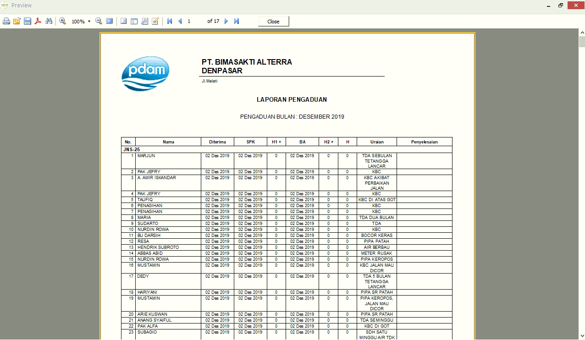

= Menampilkan Laporan

Laporan pada sistem Hublang bisa ditampikan dengan memilih menu laporan dan mengikuti  langkah - langkah sebagai berikut : 

1. Pilih Menu *Laporan*
+ 

2. Pilih *Kategori Laporan* yang tersedia
+ 

3. Pilih salah satu jenis laporan yang akan ditampikan, setiap kategori Laporan memiliki detail dan list data yang berbeda
+ 

4. Isi *Filter Form* sesuai dengan data yang ingin ditampilkan
+ 

5. Sistem akan menampilkan laporan sesuai dengan filter yang sudah ditentukan
