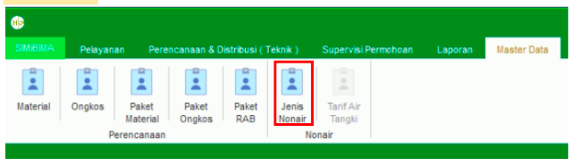
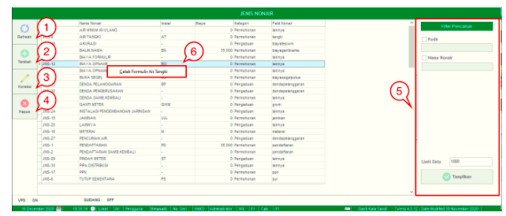
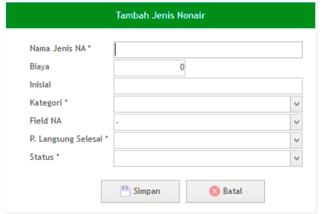

= Mengelola Data Jenis Non Air

Fitur *Jenis Nonair* bisa diakses dengan cara klik *Master Data → Jenis Nonair* sesuai gambar di atas. Ada 5 bagian di dalam fitur ini, meliputi  *Refresh*, *Tambah Jenis Nonair*, *Koreksi* *Jenis Nonair*, *Hapus Jenis Nonair* , *Filter Pencarian*, dan *Klik Kanan Action* seperti gambar di bawah ini.

1. *Refresh* digunakan untuk memperbarui data, sehingga bisa memastikan masuk tidaknya data yang diajukan.
2. Klik pada ikon *Tambah* Jenis Nonair untuk menambah data baru. Isi _form_ sesuai _field_ yang tersedia, kemudian klik tombol *Simpan* seperti gambar di bawah ini.
+

3. *Koreksi Jenis Nonair* digunakan untuk mengubah data. Pilih data yang ada pada daftar, kemudian klik tombol *Koreksi*.
4. *Hapus Jenis Nonair* digunakan untuk menghapus data Jenis Nonair. Pilih data yang ingin dihapus pada daftar, kemudian klik tombol *Hapus*.
5. *Filter Pencarian Jenis Nonair* digunakan untuk mencari data sesuai dengan kebutuhan. Pencarian data *Jenis Nonair* bisa dilakukan dengan cara mengisi _form_ sesuai dengan _field_ yang sudah ditentukan, kemudian klik tombol *Tampilkan*.
6. *Klik Kanan Action Jenis Nonair* digunakan untuk mencetak formulir Air Tangki sesuai dengan data yang dipilih pada daftar data Jenis Nonair
