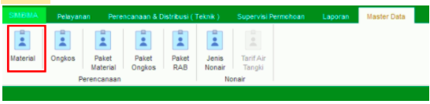
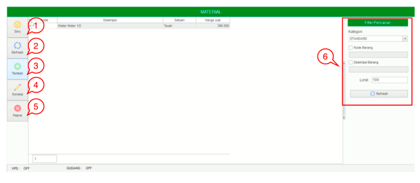
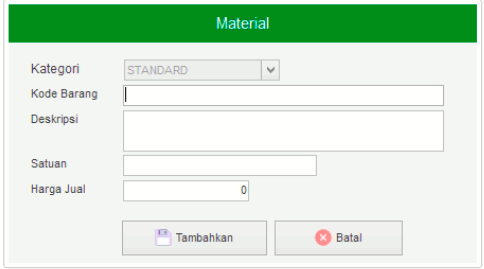

= Mengelola Data Material

Fitur *Material* bisa diakses dengan cara klik *Master Data → Material* sesuai gambar di atas. Ada 6 bagian yang bisa diakses pada menu ini, meliputi *Sinc*, *Refresh*, *Tambah*, *Koreksi*, *Hapus*, dan *Filter Pencarian* seperti gambar di bawah ini. 

1. *Sinc* digunakan untuk melakukan sinkronisasi data Material yang ada di master data.
2. *Refresh* digunakan untuk memperbarui data, sehingga bisa memastikan masuk tidaknya data yang diajukan.
3. Klik pada ikon *Tambah* untuk menambah data baru. Lengkapi field yang ada untuk menambahkan data Material. Kemudian klik tombol *Tambahkan* untuk menyimpan data Material seperti gambar di bawah ini.
+

4. *Koreksi* digunakan untuk mengubah data Material. Pilih data yang akan diubah pada daftar, kemudian klik tombol *Koreksi*.
5. *Hapus* digunakan untuk menghapus data Material dalam list. Pilih data yang akan dihapus dari daftar, kemudian klik tombol *Hapus*.
6. *Filter Pencarian* digunakan untuk mencari data Material sesuai dengan kebutuhan. Pencarian data Material bisa dilakukan dengan cara mengisi _form_ sesuai dengan _field_ yang sudah ditentukan, kemudian klik tombol *Refresh*.
