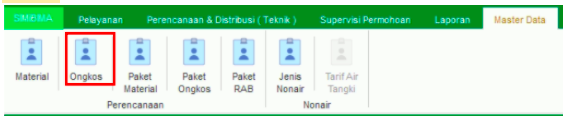
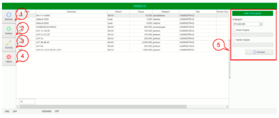
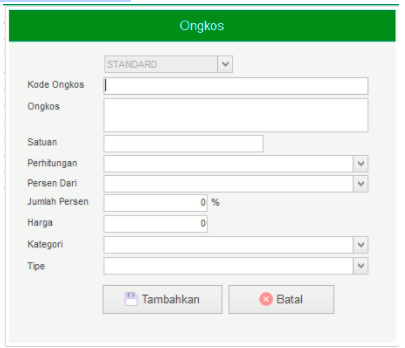

= Mengelola Data Ongkos

Fitur *Ongkos* bisa diakses dengan cara klik *Master Data → Ongkos* sesuai gambar di atas. Ada 5 bagian di dalam fitur Ongkos, meliputi  *Refresh*, *Tambah*, *Koreksi*, *Hapus*, dan *Filter Pencarian* seperti gambar di bawah ini.

1. *Refresh* digunakan untuk memperbarui data, sehingga bisa memastikan masuk tidaknya data yang diajukan.
2. Klik pada ikon *Tambah* untuk menambah data Ongkos baru. Lengkapi _field_ yang ada, kemudian klik tombol *Tambahkan* seperti gambar di bawah ini.
+

3. *Koreksi* digunakan untuk mengubah pada data Ongkos. Pilih data yang ingin diubah pada daftar, kemudian klik tombol *Koreksi*.
4. *Hapus* digunakan untuk menghapus data Ongkos dari daftar. Pilih data yang akan dihapus, kemudian klik tombol *Hapus*.
5. *Filter Pencarian* digunakan untuk mencari data Ongkos sesuai dengan kebutuhan. Pencarian data Ongkos bisa dilakukan dengan cara mengisi _form_ sesuai dengan _field_ yang sudah ditentukan kemudian klik tombol *Refresh*.