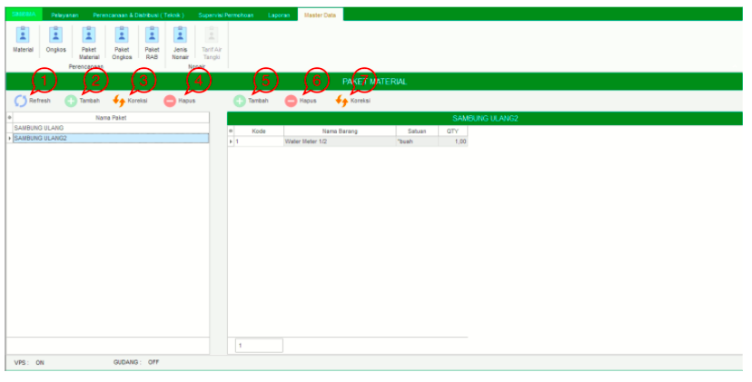

= Mengelola Data Paket Material

Fitur *Paket Material* bisa diakses dengan cara klik *Master Data → Paket Material* sesuai gambar di atas. Ada 7 bagian yang bisa diakses pada fitur ini, meliputi *Refresh*, *Tambah Paket*, *Koreksi Paket*, *Hapus Paket*, *Tambah Nama Barang*, *Hapus Nama Barang*, dan *Koreksi Nama Barang* seperti gambar di bawah ini.

1. *Refresh Paket Material* memperbarui data, sehingga bisa memastikan masuk tidaknya data yang diajukan.
2. Klik pada ikon *Tambah* Data Paket untuk menambah data baru seperti no.2 pada gambar utama di atas. Kemudian, isi _field_ nama paket yang akan ditambahkan. Klik tombol *Simpan* untuk menambahkan Nama Paket Baru.
+

3. *Koreksi Paket* digunakan untuk mengubah data Nama Paket Material. Pilih data yang ingin diubah pada daftar, kemudian klik tombol *Koreksi*.
4. *Hapus Paket* digunakan untuk menghapus data Nama Paket Material dari daftar. Pilih data yang ingin dihapus, kemudian klik tombol *Hapus*.
5. Klik pada ikon *Tambah Data Nama Barang* untuk menambah data baru seperti no.5 pada gambar utama di atas. Cari Nama Barang yang akan ditambahkan, kemudian klik pada barang yang dipilih.
+

6. *Hapus Nama Barang* digunakan untuk menghapus data Nama Barang dari daftar. Pilih data yang ingin dihapus, kemudian klik tombol *Hapus*.
7. *Koreksi Nama Barang* digunakan untuk mengubah data Nama Barang. Pilih data yang ingin diubah, kemudian klik tombol *Koreksi*.
