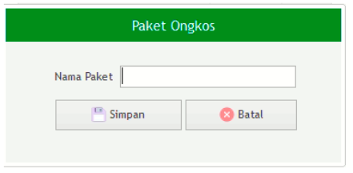

= Mengelola Data Paket Ongkos

Fitur *Paket Ongkos* bisa diakses dengan cara klik *Master Data → Paket Ongkos* sesuai gambar di atas. Ada 7 bagian yang bisa diakses pada fitur ini, meliputi *Refresh*, *Tambah Paket*, *Koreksi Paket*, *Hapus Paket*, *Tambah Ongkos*, *Hapus Nama Ongkos*, dan *Koreksi Nama Ongkos* seperti gambar di bawah ini.

1. *Refresh Paket Ongkos* memperbarui data, sehingga bisa memastikan masuk tidaknya data yang diajukan.
2. Klik pada ikon *Tambah Data Paket Ongkos* untuk menambah data baru.  Isi field nama paket yang akan ditambahkan, kemudian klik tombol *Simpan* untuk menambahkan *Nama Paket Baru* seperti gambar di bawah ini.
+

3. *Koreksi Paket* digunakan untuk mengubah data Paket Ongkos. Pilih data yang ada pada daftar, kemudian klik tombol *Koreksi*.
4. *Hapus Paket* digunakan untuk menghapus data dari daftar. Pilih data yang akan dihapus, kemudian klik tombol *Hapus*.
5. Klik pada ikon *Tambah Data Nama Ongkos* untuk menambah data baru. Cari *Nama Ongkos* yang akan ditambahkan, kemudian klik pada barang yang dipilih seperti gambar di bawah ini.

+

6. *Hapus Nama Barang* digunakan untuk menghapus data dari daftar. Pilih data yang akan dihapus pada daftar, kemudian klik tombol *Hapus*.
7. *Koreksi Nama Ongkos* digunakan untuk mengubah data Paket Ongkos. Pilih data yang akan diubah, kemudian klik tombol *Koreksi*.
