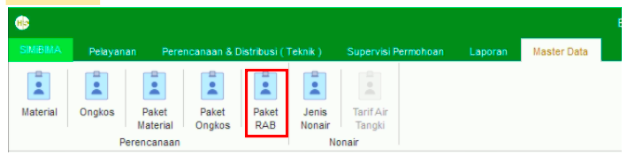
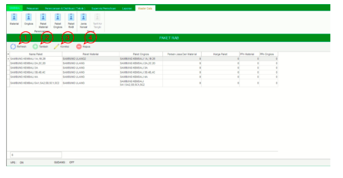
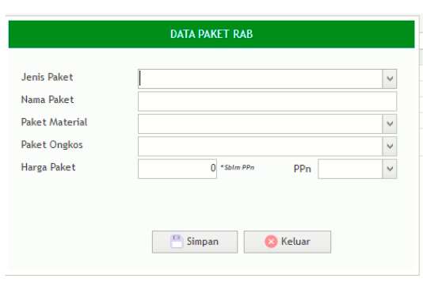

= Mengelola Data Paket RAB

Fitur *Paket RAB* bisa diakses dengan cara klik *Master Data → Paket RAB* sesuai gambar di atas. Ada 4 bagian di dalam di dalam fitur ini, meliputi  *Refresh*, *Tambah Paket RAB*, *Koreksi Paket RAB*, dan *Hapus Paket RAB* seperti gambar di bawah ini.

1. *Refresh* digunakan untuk memperbarui data, sehingga bisa memastikan masuk tidaknya data yang diajukan.
2. Klik pada ikon *Tambah Paket RAB* untuk menambah data baru. Isi form yang tersedia, kemudian klik tombol *Simpan* untuk menambahkan Data Paket RAB seperti gambar di bawah ini.
+

3. *Paket* digunakan untuk mengubah data Paket RAB. Pilih data yang ada di daftar, kemudian klik tombol *Koreksi*.
4. *Hapus* Paket digunakan untuk menghapus data di dalam daftar. Pilih data yang akan dihapus, kemudian klik tombol *Hapus*.
