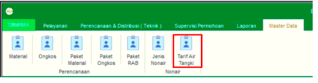
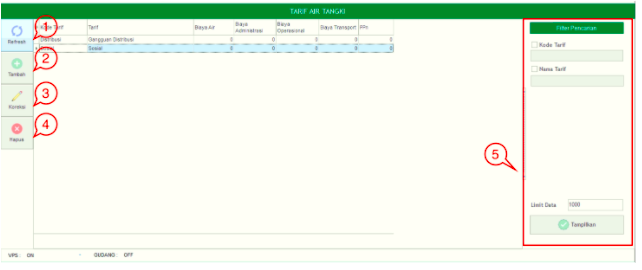
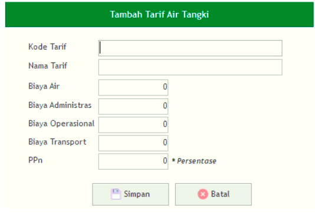

= Mengelola Data Tarif Air Tangki

Fitur ini bisa diakses dengan cara klik *Master Data → Tarif Air Tangki*  sesuai gambar di atas. Ada 6 bagian di dalam fitur ini, meliputi  *Refresh*, *Tambah*  *Tarif Air Tangki* , *Koreksi  Tarif Air Tangki*,  *Hapus  Tarif Air Tangki*, dan *Filter Pencarian  Tarif Air Tangki*  dengan penjelasan detail masing-masing fitur di bawah ini.

1. *Refresh Tarif Air Tangki* digunakan untuk memperbarui data, sehingga bisa memastikan masuk tidaknya data yang diajukan.
2. Klik pada ikon *Tambah Tarif Air Tangki* digunakan untuk menambah data baru. Isi _form_ yang tersedia  untuk menambahkan *Tarif Air Tangki* yang baru, kemudian klik tombol *Simpan* untuk menambahkan data Tarif Air Tangki seperti gambar di bawah ini.
+

3. *Koreksi Tarif Air Tangki* digunakan untuk mengubah data Tarif Air Tangki. Pilih data yang akan diubah pada daftar, kemudian klik tombol *Koreksi*.
4. *Hapus Tarif Air Tangki* digunakan untuk menghapus data tarif. Pilih data yang akan dihapus pada daftar, kemudian klik tombol *Hapus*.
5. *Filter Pencarian Tarif Air Tangki* digunakan untuk mencari data  sesuai dengan kebutuhan. Pencarian data Tarif Air Tangki bisa dilakukan dengan cara mengisi _form_ sesuai dengan _field_ yang sudah ditentukan, kemudian klik *Tampilkan*.