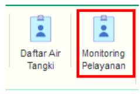
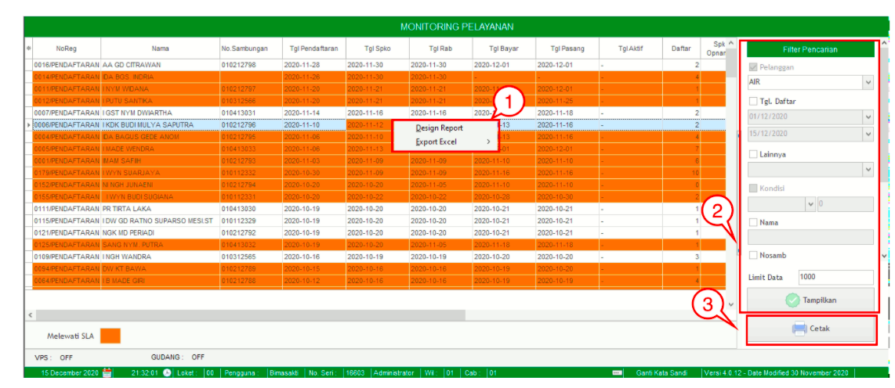

= Melakukan Monitoring Pelayanan

Fitur *Monitoring Pelayanan* digunakan untuk melakukan monitor pelayanan yang ada dalam sistem. *Fitur Monitoring Pelayanan* memiliki 3 fungsi, yaitu *Filter Pencarian*, *Cetak*, dan *Action Klik Kanan*. Berikut untuk detail dari menu yang ada di dalam fitur *Monitoring Pelayanan* : 

1. *Klik Kanan Action Monitoring Pelayanan*
+
Anda dapat melakukan klik kanan pada _row_ data *Monitoring Pelayanan* untuk menampilkan _action_ menu. Berikut adalah penjelasan untuk masing-masing _action_ menu: 

- *Design Report* : Untuk melakukan _custom design_ Monitoring Pelayanan

- *Export Excel* : Untuk melakukan _export_ data Monitoring Pelayanan berupa _file_ Excel

2. *Filter Pencarian Monitoring Pelayanan*
+
_Field_ *Filter* digunakan untuk mencari data *Monitoring Pelayanan* sesuai dengan kebutuhan. Untuk melakukan pencarian data *Monitoring Pelayanan* bisa dilakukan dengan cara mengisi form sesuai dengan _field_ yang sudah ditentukan kemudian klik tombol *Tampilkan*.

3. *Cetak Monitoring Pelayanan*
+
_Action_ *Cetak* digunakan untuk mencetak daftar *Monitoring Pelayanan* secara keseluruhan atau berdasarkan filter.
