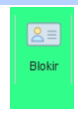
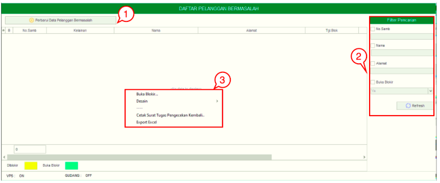
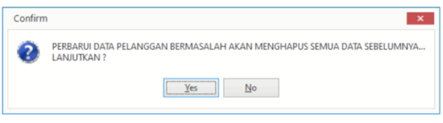

= Melakukan Pemblokiran Pelanggan Bermasalah 

Fitur ini digunakan oleh petugas untuk membatasi dan menghilangkan transaksi pelanggan sesuai dengan kelainan atau pengaduan yang dilaporkan dari kelainan yang diinput dari petugas Bacameter.

Fitur *Blokir* meliputi 3 fungsi, yaitu *Perbarui Pelanggan Bermasalah*, *Filter Pencarian* dan *Action Klik Kanan*. Berikut untuk _detail_ dari fungsi yang ada di dalam menu Blokir : 

1. *Perbarui Data Pelanggan Bermasalah*
+
Apabila pengguna mengklik tombol *Perbarui Data Pelanggan Bermasalah*, maka semua data sebelumnya akan *terhapus otomatis*. 
+

- *Pop Up* Konfirmasi akan muncul ketika melakukan klik pada Tombol *Perbarui Data Pelanggan Bermasalah*

2. *Pencarian Data Pelanggan Bermasalah*
+
_Field_ Filter digunakan untuk mencari data Data Pelanggan Bermasalah sesuai dengan kebutuhan. Untuk melakukan pencarian data Data Pelanggan Bermasalah bisa dilakukan dengan cara mengisi form sesuai dengan _field_ yang sudah ditentukan kemudian klik tombol *Refresh*.

3. *Action Menu saat diklik kanan* 
+
Anda dapat melakukan klik kanan pada _row_ Data Pelanggan Bermasalah untuk menampilkan action menu. Berikut adalah penjelasan untuk masing-masing _action_ menu:  

- *Buka Blokir* : Menu Buka Blokir digunakan untuk membuat blokir dari pelanggan yang sebelumnya bermasalah berdasarkan data yang dipilih di dalam Daftar Pelanggan Bermasalah.
- *Desain* : Menu Desain digunakan untuk melakukan custom design Pelanggan Bermasalah
- *Cetak Surat Tugas Pengecekan Kembali* : Digunakan untuk Mencetak Surat Tugas Pengecekan Kembali dari data yang dipilih dari list Daftar Pelanggan Bermasalah
- *Export Excel* : Untuk melakukan _export_ data Daftar Pelanggan Bermasalah berupa _file_ Excel
