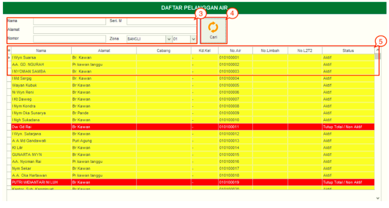

= Melihat Detail Pelanggan
 
image::../images-hublang/hublang-detail-pelanggan-info-1.png[align="center"]

Menu Info menampilkan informasi yang meliputi *Data Pelanggan*, *Histori Pembacaan Meter*, *Tagihan*, *Histori Pembayaran*, *Histori Berita Acara*, *Foto Rumah*, dan *Denah Sambungan Baru*. Berikut cara untuk melihat detail pelanggan :

image::../images-hublang/hublang-detail-pelanggan-info-2.png[align="center"]

1. Isilah informasi di kolom dropdown *Pelanggan* dengan cara memilih jenis tagihan (air) 
2. Masukkan *Nomor Sambungan*, kemudian tekan tombol *teropong* di sebelah kolom nomor sambungan
+

3. Berikutnya, input filter pencarian berdasarkan *Nama*, *Alamat*, *Nomor Sambungan* atau *no seri Meter*.
4. Tekan tombol *Cari*
5. Selanjutnya akan muncul tabel berisi daftar pelanggan air. Lakukan _double click_ pada salah satu daftar pelanggan.
+
image::../images-hublang/hublang-detail-pelanggan-info-4.png[align="center"]
6. User dapat menggunakan sub-fitur *Data Pelanggan*, *Histori Pembacaan Meter*, *Tagihan*, *Histori Pembayaran*, *Histori Berita Acara*, *Foto Rumah*, dan *Denah Sambungan Baru* untuk mengetahui detail info pelanggan.