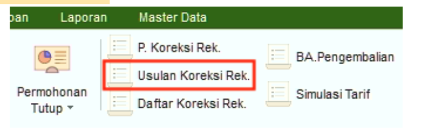
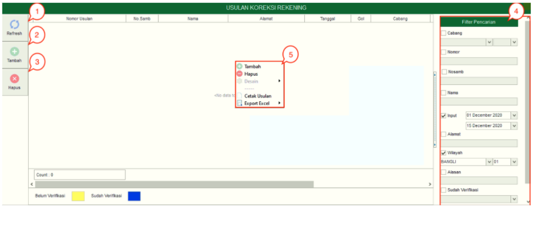
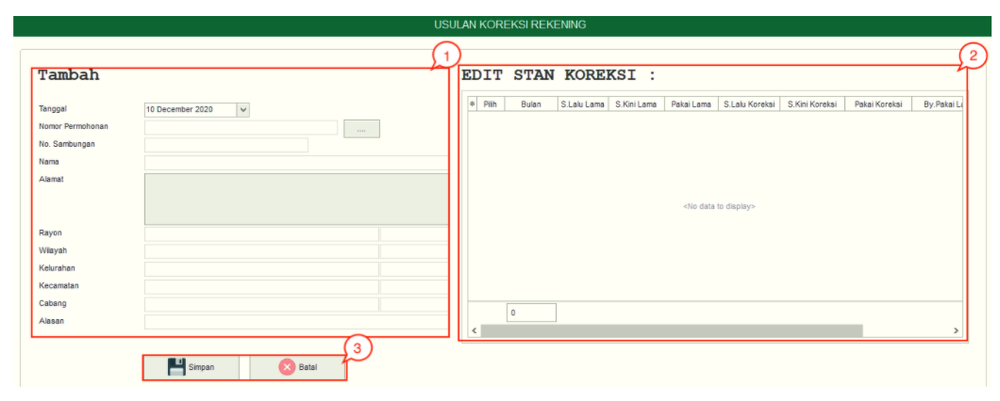

= Membuat dan Menghapus Usulan Koreksi Rekening

Fitur *Usulan Koreksi Rekening* digunakan untuk mengusulkan pelaksanaan koreksi rekening pelanggan. Berikut adalah penjelasan fitur *Usulan Koreksi Rekening*:

1. *Refresh Usulan Koreksi Rekening*
+
Tombol *Refresh* digunakan untuk memperbarui data Usulan Koreksi Rekening  yang mungkin belum masuk ketika data sudah di-_submit_.

2. *Tambah Usulan Koreksi Rekening*
+
Tombol *Tambah* digunakan untuk menambah data baru dari Permohonan Usulan *Koreksi Rekening*. Berikut cara untuk menambah data baru Usulan *Koreksi Rekening*: 
+

+
[arabic]
. Isi *form yang tersedia* pada menu tambah data Usulan Koreksi Rekening
. Setelah memasukkan data, kemudian lakukan koreksi data pada kolom *Edit Stan Koreksi*.
. Klik tombol *Simpan* untuk menambahkan data Usulan Koreksi Rekening yang baru. Tombol *Batal* digunakan untuk melakukan cancel pada data yang akan ditambahkan.
