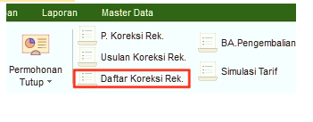
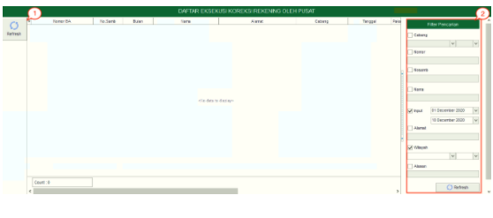

= Menampilkan Daftar Koreksi Rekening Pelanggan

Fitur *Daftar Koreksi Rekening* digunakan untuk melihat daftar koreksi rekening milik pelanggan. Berikut adalah penjelasan mengenai fitur *Daftar Koreksi Rekening*:

1. *Refresh Daftar Koreksi Rekening*
+
Menu *Refresh* digunakan untuk memperbarui data Daftar Koreksi Rekening  yang mungkin belum masuk ketika data sudah disubmit

2. *Filter Daftar Koreksi Rekening*
+
Menu *Filter* digunakan untuk mencari data Daftar Koreksi Rekening sesuai dengan kebutuhan. Untuk melakukan pencarian data Daftar Koreksi Rekening bisa dilakukan dengan cara mengisi _form_ sesuai dengan _field_ yang sudah ditentukan kemudian Refresh
