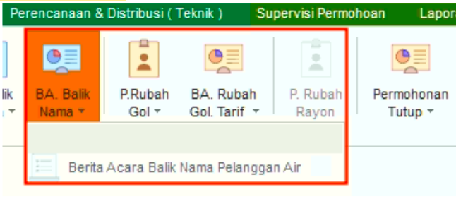
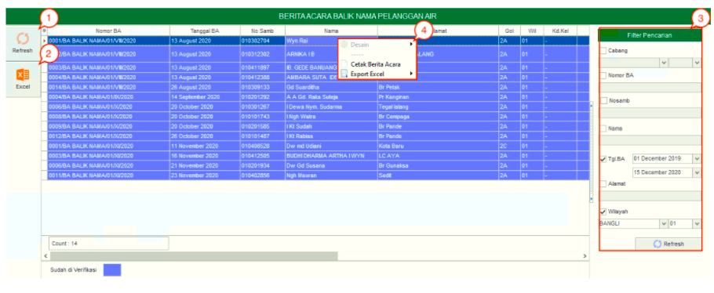

= Mengelola Berita Acara Permohonan Balik Nama

Fitur *BA Balik Nama* digunakan untuk membaca, menambah, atau mengedit berita acara balik nama pelanggan sesuai dengan jenisnya. Fitur ini juga menampilkan berita acara balik nama pelanggan yang telah diverifikasi maupun yang belum diverifikasi. Fitur ini memiliki sub-fitur *Berita Acara Balik Nama Pelanggan Air*. Berikut adalah penjelasan mengenai sub-fitur tersebut:

1. *Refresh Berita Acara Balik Nama Pelanggan Air*
+
Tombol *Refresh* digunakan untuk memperbarui data Berita Acara Balik Nama Pelanggan Air  yang mungkin belum masuk ketika data sudah disubmit

2. *Excels Berita Acara Balik Nama Pelanggan Air* 
+
Tombol *Excel* digunakan untuk mengunggah/menyimpan file dalam format Excel untuk masuk menjadi _list_ data Berita Acara Balik Nama Pelanggan Air.

3. *Filter Berita Acara Balik Nama Pelanggan Air* 
+
_Field_ *Filter* digunakan untuk mencari data Berita Acara Balik Nama Pelanggan Air sesuai dengan kebutuhan. Pencarian data Berita Acara Balik Nama Pelanggan Air dapat dilakukan dengan cara mengisi _form_ sesuai dengan _field_ yang sudah ditentukan, kemudian *Refresh*.

4. *Action Menu saat diklik kanan* 
+
Anda dapat melakukan klik kanan pada row data Berita Acara Balik Nama Pelanggan Air untuk menampilkan action menu. Berikut adalah penjelasan untuk masing-masing _action_ menu:

- *Cetak Berita Acara*: Untuk mencetak Berita Acara Balik Nama Pelanggan Air
- *Export Excel*: Untuk _export_ data yang dipilih ke format Excel
