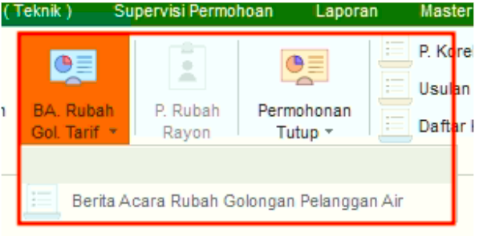
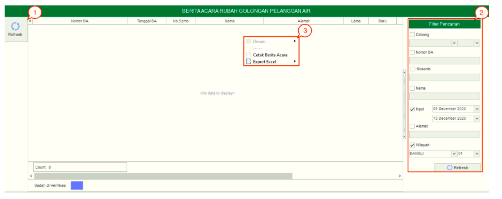

= Mengelola Berita Acara Rubah Golongan

Fitur *BA.Rubah Gol* akan menampilkan berita acara ubah golongan yang sudah dilakukan. Pada Fitur ini terdapat sebuah sub-fitur yakni *Berita Acara Rubah Golongan Pelanggan Air*. Berikut adalah penjelasan mengenai fungsi-fungsi dalam sub-fitur *Berita Acara Rubah Golongan Pelanggan Air*:

1. *Refresh Berita Acara Rubah Golongan Pelanggan Air*
+
Tombol *Refresh* digunakan untuk memperbarui data Berita Acara Rubah Golongan Pelanggan Air yang mungkin belum masuk ketika data sudah di-_submit_.

2. *Filter Berita Acara Rubah Golongan Pelanggan Air*
+
_Field_ *Filter* digunakan untuk mencari data Berita Acara Rubah Golongan Pelanggan Air sesuai dengan kebutuhan. Pencarian data Berita Acara Rubah Golongan Pelanggan Air dapat dilakukan dengan cara mengisi _form_ sesuai dengan _field_ yang sudah ditentukan, kemudian klik *Refresh*

3. *Action Menu saat diklik kanan* 
+
Anda dapat melakukan klik kanan pada _row_ data Berita Acara Rubah Golongan Pelanggan Air untuk menampilkan _action menu_. Berikut adalah penjelasan untuk masing-masing _action menu_: 

- *Cetak Berita Acara*: Untuk Mencetak Berita Acara 
- *Export Excel*: Untuk _export_ data yang dipilih ke format Excel