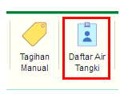
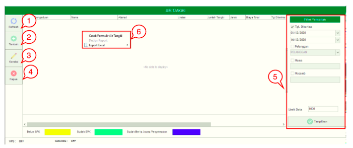
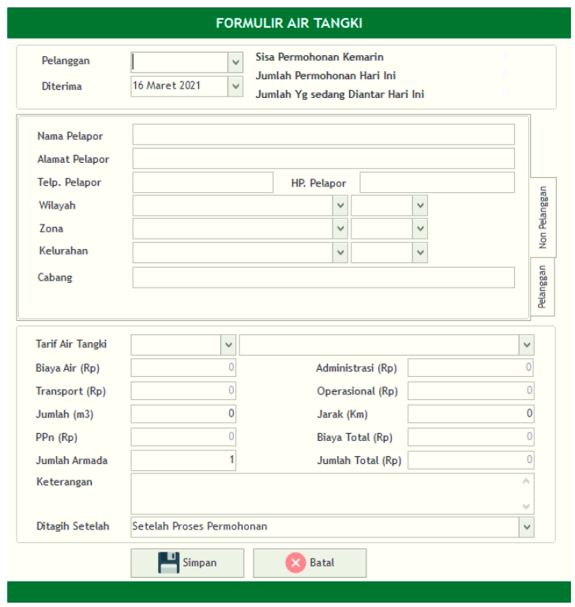

= Mengelola Data Air Tangki

Fitur *Daftar Air Tangki* digunakan untuk melayani dan membuat daftar Air Tangki yang akan dimasukan ke sistem. Fitur *Daftar Air Tangki* meliputi Tombol *Refresh*, *Tambah*, *Koreksi*, *Hapus*, *Filter Pencarian*, dan *Action Klik Kanan*. Berikut untuk detail fitur *Daftar Air Tangki* :

1. *Refresh Daftar Air Tangki*
+
Tombol *Refresh* digunakan untuk memperbarui data *Daftar Air Tangki* yang mungkin belum masuk ketika data sudah di-_submit_.

2. *Tambah Daftar Air Tangki*
+
Tombol *Tambah* digunakan untuk menambah data baru air tangki. Ikuti langkah-langkah berikut untuk menambah data baru  *Daftar Air Tangki* :  
+

+
[arabic]
. Lengkapi *form yang tersedia* untuk menambah data baru Daftar Air Tangki.
. Kemudian klik Tombol *Simpan* untuk menambah data baru yang sudah diisi.

3. *Koreksi Daftar Air Tangki*
+
Tombol *Koreksi* digunakan untuk melakukan koreksi pada data *Daftar Air Tangki*. Untuk melakukan Koreksi, Anda dapat memilih salah satu data yang ada pada daftar, kemudian klik tombol *Koreksi*.

4. *Hapus Daftar Air Tangki*
+
Tombol *Hapus* digunakan untuk menghapus data *Daftar Air Tangki* dari daftar. Untuk menghapus data bisa dilakukan dengan salah satu data pada daftar kemudian klik tombol *Hapus*.

5. *Filter Pencarian Daftar Air Tangki*
+
_Field_ *Filter* digunakan untuk mencari data *Daftar Air Tangki* sesuai dengan kebutuhan. Untuk melakukan pencarian data *Daftar Air Tangki* bisa dilakukan dengan cara mengisi _form_ sesuai dengan _field_ yang sudah ditentukan kemudian klik tombol *Tampilkan*.

6. *Action Menu saat diklik kanan*
+
Anda dapat melakukan klik kanan pada _row_ Daftar Air Tangki untuk menampilkan action menu. Berikut adalah penjelasan untuk masing-masing _action_ menu:

- *Cetak Formulir Air Tangki* : digunakan untuk mencetak Formulir Air Tangki sesuai dengan data yang dipilih pada daftar Air Tangki

- *Export Excel* : Untuk melakukan *export* data Daftar Air Tangki berupa *file* Excel