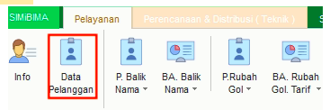
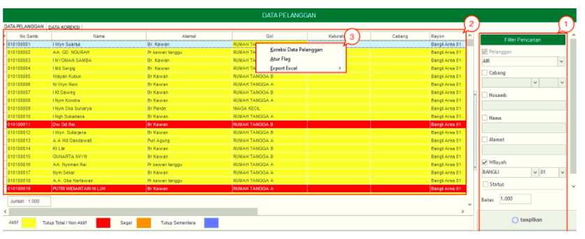
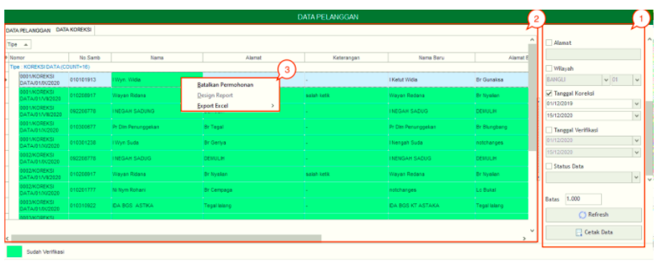
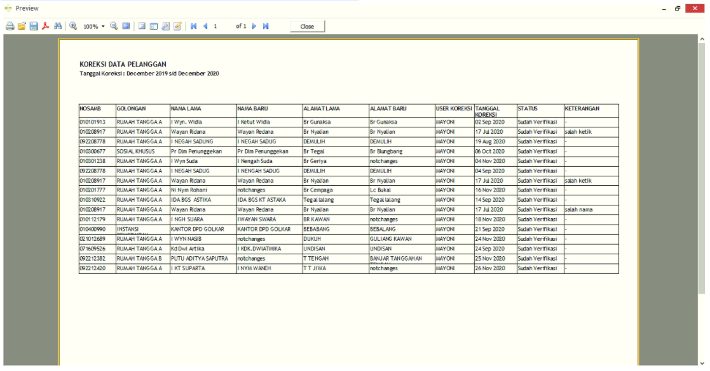

= Mengelola Data Pelanggan

Fitur *Data Pelanggan* digunakan untuk melihat *Data Pelanggan* dan *Data Koreksi*. Berikut adalah penjelasan mengenai Data Pelanggan dan Data Koreksi:

== Data Pelanggan

1. *Filter Data Pelanggan*
+
*Filter* digunakan untuk mencari data pelanggan sesuai dengan kebutuhan. Untuk melakukan pencarian data, Anda dapat mengisi _form_ sesuai dengan _field_ yang sudah ditentukan kemudian klik pada tombol *Tampilkan*.

2. *Kolom Data Pelanggan*
+
*Kolom Data Pelanggan* digunakan untuk menampilkan data pelanggan yang telah user input pada *filter*.

3. *Action Menu saat diklik kanan*
+
Anda dapat melakukan klik kanan pada _row_ data pelanggan untuk menampilkan _action menu_. Berikut adalah penjelasan untuk masing-masing _action menu_:

- Koreksi Data Pelanggan: Untuk melakukan koreksi pada data pelanggan
- Atur Flag: Untuk mengatur flag pada pelanggan
- Export Excel: Untuk _export_ data yang dipilih ke format Excel 

== Data Koreksi

Data koreksi adalah rekapan data yang telah dikoreksi _user_. Dalam menu ini akan ditampilkan semua data yang telah dikoreksi.

1. *Filter Data Koreksi*
+
*Filter* digunakan untuk mencari data pelanggan sesuai dengan kebutuhan. Untuk melakukan pencarian data, Anda dapat mengisi _form_ sesuai dengan _field_ yang sudah ditentukan kemudian klik pada tombol *Refresh*. Apabila hendak mencetak data koreksi pelanggan maka klik tombol *Cetak Data*, seperti contoh dibawah ini :

+ 

2. *Kolom Data koreksi*
+
*Kolom Data Koreksi* digunakan untuk menampilkan data pelanggan yang telah user input pada *filter*.

3. *Action Menu saat diklik kanan*
+
Anda dapat melakukan klik kanan pada _row_ data untuk menampilkan _action_ menu. Berikut adalah penjelasan untuk masing-masing action menu:

- *Batalkan Permohonan*: Untuk melakukan pembatalan koreksi pada data pelanggan

- *Export Excel*: Untuk _export_ data yang dipilih ke format Excel