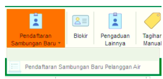
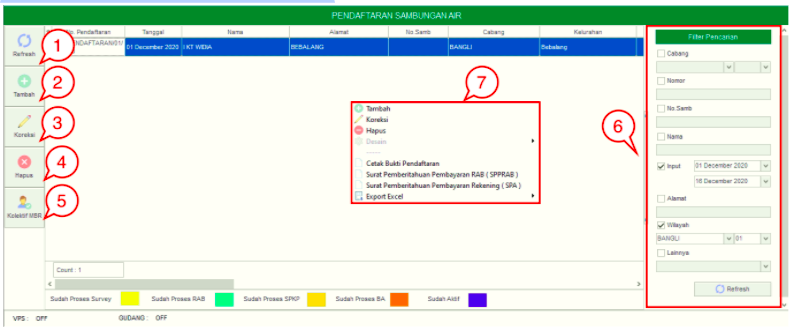
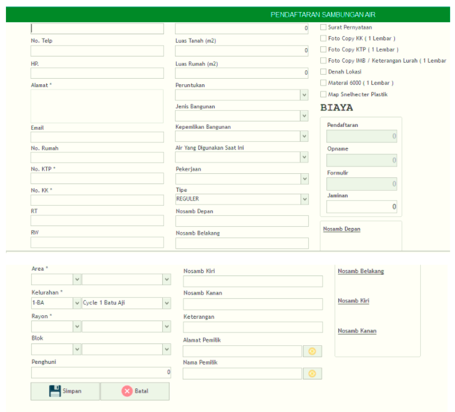
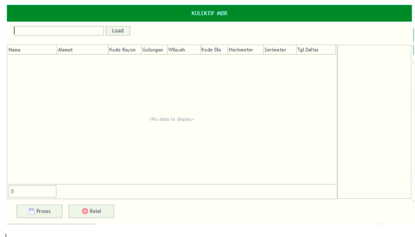

= Mengelola Pendaftaran Sambungan Baru

Fitur ini digunakan setiap kali ada nomor sambungan air baru yang akan didaftarkan

Menu *Pendaftaran Sambungan Baru Pelanggan Air* memiliki meliputi Tombol *Refresh*, *Tambah*, *Koreksi*, *Hapus*, *Kolektif MBR*, *Filter Pencarian* dan *Klik Kanan Action Button*. Berikut adalah _detail_ menu yang ada pada Pendaftaran Sambungan Baru Pelanggan Air :

1. *Refresh  Pendaftaran Sambungan Baru Pelanggan Air*
+
Tombol *Refresh* digunakan untuk memperbarui data  Pendaftaran Sambungan Baru Pelanggan Air yang mungkin belum masuk ketika data sudah di-_submit_.

2. *Tambah Pendaftaran Sambungan Baru Pelanggan Air*
+
Tombol *Tambah* digunakan untuk menambah data baru dengan klik pada icon Tambah. Berikut cara untuk menambah data baru Pendaftaran Sambungan Baru Pelanggan Air:
+

+
[arabic]
. Lengkapi *form yang tersedia* untuk menambahkan data baru pada Pendaftaran Sambungan Baru Pelanggan Air. 
. Kemudian klik tombol *Simpan*.

3. *Koreksi Pendaftaran Sambungan Baru Pelanggan Air*
+
Tombol *Koreksi* digunakan untuk melakukan koreksi pada data  Pendaftaran Sambungan Baru Pelanggan Air. Untuk melakukan Koreksi, Anda dapat memilih data pada daftar, kemudian klik tombol *Koreksi*.

4. *Hapus Pendaftaran Sambungan Baru Pelanggan Air*
+
Tombol *Hapus* digunakan untuk menghapus data Pendaftaran Sambungan Baru Pelanggan Air dari daftar. Untuk memprosesnya, Anda dapat memilih data yang akan dihapus, kemudian klik tombol *Hapus*.

5. *Kolektif MBR Pendaftaran Sambungan Baru Pelanggan Air*
+
Tombol *Kolektif MBR* digunakan untuk memproses data Pendaftaran Sambungan Baru Pelanggan Air secara kolektif. Klik tombol *Kolektif MBR* untuk melakukan proses kolektif.

+

+
[arabic]
. Cari data yang akan diproses Kolektif MBR
. Setelah dipilih, lakukan klik pada Tombol *Proses*.

6. *Filter Pencarian Pendaftaran Sambungan Baru Pelanggan Air*
+
Field Filter digunakan untuk mencari data Pendaftaran Sambungan Baru Pelanggan Air sesuai dengan kebutuhan. Untuk melakukan pencarian, Anda dapat mengisi _form_ sesuai dengan _field_ yang sudah ditentukan, kemudian klik tombol *Refresh*.

7. *Action Menu saat diklik kanan* 
+
Anda dapat melakukan klik kanan pada _row_ data Pendaftaran Sambungan Baru Pelanggan Air untuk menampilkan _action menu_. Berikut adalah penjelasan untuk masing-masing _action menu_:  

- *Tambah* : Untuk menambah data Pendaftaran Sambungan Baru Pelanggan Air Baru

- *Koreksi* : Untuk melakukan koreksi (edit) terhadap data Pendaftaran Sambungan Baru Pelanggan Air yang dipilih

- *Hapus* : Untuk menghapus pada data Pendaftaran Sambungan Baru Pelanggan Air yang dipilih

- *Desain* : Untuk melakukan _custom design_ Pendaftaran Sambungan Baru Pelanggan Air

- *Cetak Bukti Pendaftaran* : untuk mencetak bukti pembayaran Pendaftaran Sambungan Baru Pelanggan Air yang dipilih

- *Surat Pemberitahuan Pembayaran RAB (SPPRAB)* : untuk menampilkan dan mencetak SPPRAB pada data Pendaftaran Sambungan Baru Pelanggan Air yang dipilih

- *Surat Pemberitahuan Pembayaran Rekening (SPA)* : untuk menampilkan dan mencetak SPA pada data Pendaftaran Sambungan Baru Pelanggan Air yang dipilih

- *Export Excel* : Untuk melakukan _export_ data Pendaftaran Sambungan Baru Pelanggan Air berupa _file_ Excel
