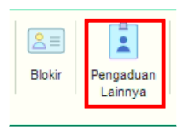
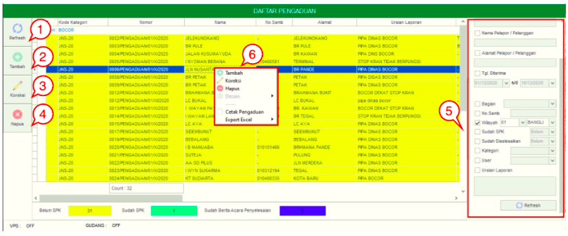
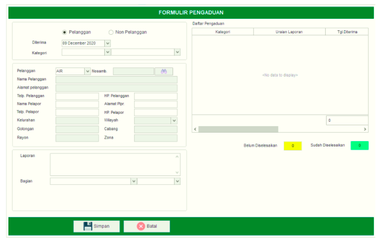
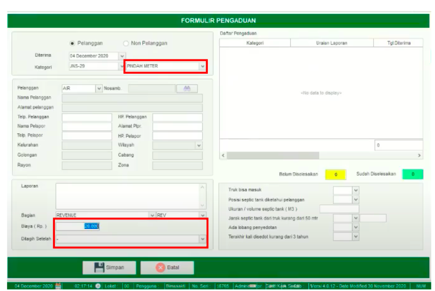

= Mengelola Pengaduan Lainnya

Fitur *Pengaduan Lainnya* digunakan untuk melayani Pengaduan yang masuk ke dalam sistem. Fitur Pengaduan Lainnya meliputi Tombol *Refresh*, *Tambah*, *Koreksi*, *Hapus*, *Filter Pencarian*, dan *Action Klik Kanan*. Berikut untuk detail dari menu yang ada di dalam fitur Pengaduan Lainnya : 

1. *Refresh Pengaduan Lainnya*
+
Tombol *Refresh* digunakan untuk memperbarui data Pengaduan Lainnya yang mungkin belum masuk ketika data sudah di-_submit_.

2. *Tambah Pengaduan Lainnya*
+
Tombol *Tambah* digunakan untuk menambah data baru pengaduan. Berikut cara untuk menambah data baru Pengaduan Lainnya :  

+

- Lengkapi *form yang tersedia* untuk menambah data baru Pengaduan Lainnya. Kemudian klik Tombol *Simpan* untuk menambah data baru yang sudah diisi.
+

+
- Ada ketentuan khusus  pada saat menambahkan *Formulir Pengaduan Baru* yaitu ada tambahan biaya ketika biaya lebih dari 0 dan biaya tersebut  akan muncul serta bisa di-_custom_ pada saat memilih kategori *Pindah Meter*.

3. *Koreksi Pengaduan Lainnya*
+
Tombol *Koreksi* digunakan untuk melakukan koreksi pada data  Pengaduan Lainnya. Untuk melakukan Koreksi, Anda dapat memilih data pada daftar, kemudian klik tombol *Koreksi*.

4. *Hapus Pengaduan Lainnya*
+
+
Tombol *Hapus* digunakan untuk menghapus data Pengaduan Lainnya. Untuk menghapus data, Anda dapat memilih salah satu data dalam daftar, kemudian klik tombol *Hapus*.

5. *Filter Pencarian Pengaduan Lainnya*
+
_Field_ Filter digunakan untuk mencari data Pengaduan Lainnya sesuai dengan kebutuhan. Untuk melakukan pencarian data, Anda dapat mengisi _form_ sesuai dengan _field_ yang sudah ditentukan, kemudian klik tombol *Refresh*.

6. *Action Menu saat diklik kanan* 
+
Anda dapat melakukan klik kanan pada _row_ Data Pengaduan Lainnya untuk menampilkan _action menu_. Berikut adalah penjelasan untuk masing-masing _action menu_: 

- *Tambah* : Untuk menambah data Pengaduan Lainnya yang baru
Koreksi : Untuk melakukan koreksi (edit) terhadap data Pengaduan Lainnya yang dipilih

- *Hapus* : Untuk menghapus data yang dipilih dalam daftar Pengaduan Lainnya

- *Cetak Pengaduan* : Untuk mencetak Data Pengaduan Lainnya yang dipilih

- *Export Excel* :  Untuk melakukan _export_ data Pengaduan Lainnya berupa _file_ Excel