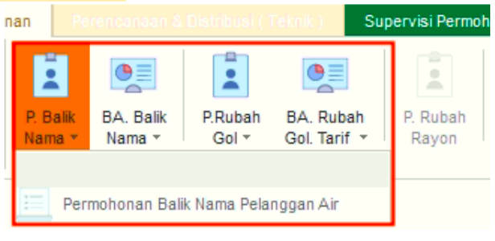
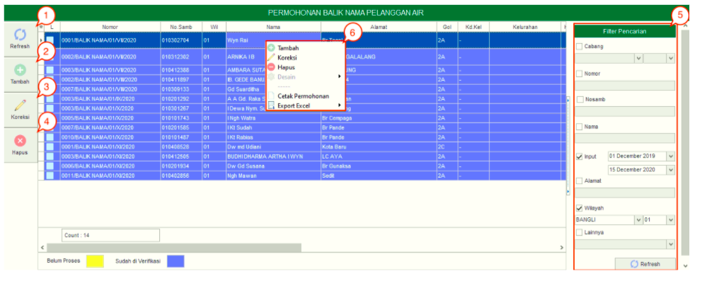
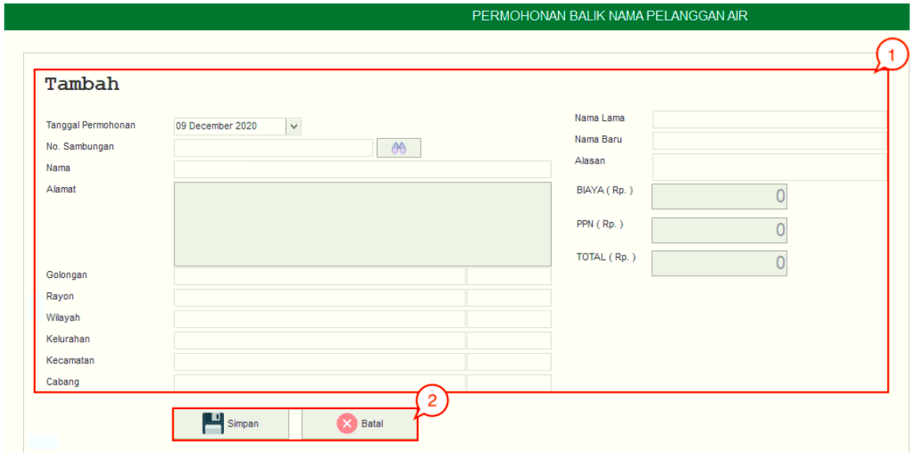

= Mengelola Permohonan Balik Nama

*Fitur Permohonan Balik Nama* digunakan untuk permohonan balik nama pelanggan. Pada tombol _dropdown_-nya, terdapat sebuah sub-fitur yaitu *Permohonan Balik Nama Pelanggan Air*. Berikut adalah penjelasan mengenai *Permohonan Balik Nama Pelanggan Air*:

1. *Refresh Permohonan Balik Nama Pelanggan Air*
+
Tombol *Refresh* digunakan untuk memperbarui data Permohonan Balik Nama Pelanggan Air  yang mungkin belum masuk ketika data sudah di-_submit_.

2. *Tambah Permohonan Balik Nama Pelanggan Air*
+
Tombol *Tambah* digunakan untuk menambah data baru Permohonan Balik Nama Pelanggan Air. Berikut cara untuk menambah data baru Permohonan Balik Nama Pelanggan Air: 
+

+
[arabic]
. *Isi form* yang tersedia pada menu tambah data
. Klik tombol *Simpan* untuk menambahkan data Permohonan Balik Nama Pelanggan Air yang baru. Tombol Batal digunakan untuk melakukan cancel pada data yang akan ditambahkan.

3. *Koreksi Permohonan Balik Nama Pelanggan Air*
+
Tombol *Koreksi* digunakan untuk melakukan koreksi pada data Permohonan Balik Nama Pelanggan Air. Koreksi bisa dilakukan dengan cara memilih data yang pada daftar, kemudian klik tombol *Koreksi*.

4. *Hapus Permohonan Balik Nama Pelanggan Air*
+
Tombol *Hapus* digunakan untuk menghapus data Permohonan Balik Nama Pelanggan Air dari daftar. Untuk menghapus data, Anda dapat memilih data pada daftar, kemudian klik tombol *Hapus*.

5. *Filter Permohonan Balik Nama Pelanggan Air*
+
*Filter* digunakan untuk mencari data Permohonan Balik Nama Pelanggan Air sesuai dengan kebutuhan. Untuk melakukan pencarian data, Anda dapat mengisi _form_ sesuai dengan _field_ yang sudah ditentukan kemudian klik pada tombol *Refresh*.

6. *Action Menu saat diklik kanan* 
Anda dapat melakukan klik kanan pada _row_ data Permohonan Balik Nama Pelanggan Air untuk menampilkan _action menu_. Berikut adalah penjelasan untuk masing-masing _action menu_:  

- *Tambah*: Untuk menambah data Permohonan Balik Nama Pelanggan Air
- *Koreksi*: Untuk melakukan koreksi (edit) terhadap data Permohonan Balik Nama Pelanggan Air yang dipilih
- *Hapus*: Untuk menghapus data yang Permohonan Balik Nama Pelanggan Air yang dipilih
- *Cetak Permohonan*: Untuk mencetak Permohonan Balik Nama Pelanggan Air
- *Export Excel*: Untuk _export_ data yang dipilih ke format Excel