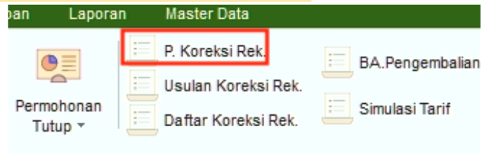
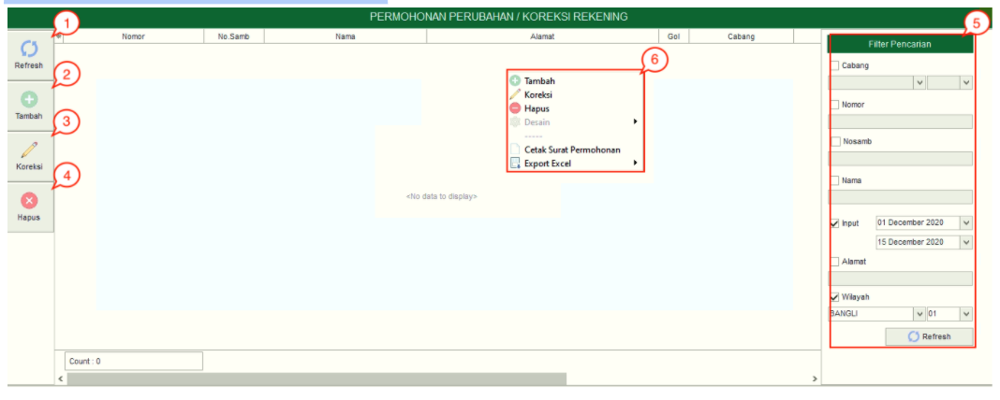
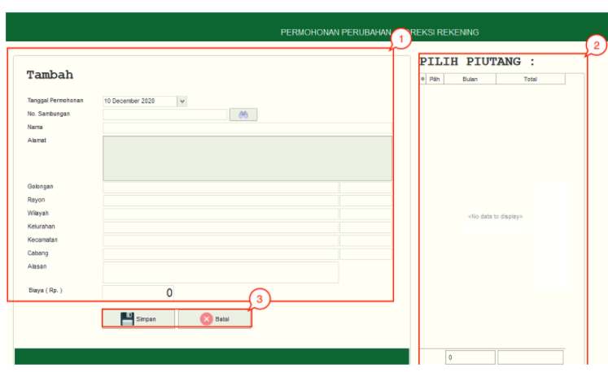

= Mengelola Permohonan Perubahan atau Koreksi Rekening

Jika terdapat pemakaian pelanggan yang tidak sesuai (berlebih/kurang), komplain pelanggan atas pemakaian airnya, atau perubahan dari PDAM sendiri , maka petugas dapat melakukan koreksi terhadap rekening yang bersangkutan. Berikut adalah penjelasan mengenai berbagai tombol, _field_, dan _action menu_ pada *Permohonan Perubahan/Koreksi Rekening*:

1. *Refresh Permohonan Perubahan/Koreksi Rekening*
+
Tombol *Refresh* digunakan untuk memperbarui data Permohonan Perubahan/Koreksi Rekening  yang mungkin belum masuk ketika data sudah di-_submit_.

2. *Tambah Permohonan Perubahan/Koreksi Rekening*
+
Tombol *Tambah* untuk menambah data baru Permohonan Perubahan/Koreksi Rekening. Berikut cara untuk menambah data baru Permohonan Perubahan/Koreksi Rekening: 
+

+
[arabic]
. Isi *form yang tersedia* pada menu tambah data Permohonan Perubahan/Koreksi Rekening
. Lihat piutang pelanggan pada pada _field_ *Pilih Piutang*, kemudian pilih piutang
. Klik tombol *Simpan* untuk menambahkan data Permohonan Perubahan/Koreksi Rekening yang baru. Tombol *Batal* digunakan untuk melakukan cancel pada data yang akan ditambahkan.

3. *Koreksi Permohonan Perubahan/Koreksi Rekening*
+
Tombol Koreksi digunakan untuk melakukan koreksi pada data Permohonan Perubahan/Koreksi Rekening. Untuk melakukan Koreksi, Anda dapat memilih data pada daftar, kemudian klik tombol *Koreksi*.

4. *Hapus Permohonan Perubahan/Koreksi Rekening*
+
Tombol *Hapus* digunakan untuk menghapus data Permohonan Perubahan/Koreksi Rekening dari daftar. Untuk menghapus data, Anda dapat memilih data pada daftar, kemudian klik tombol *Hapus*.

5. *Filter Permohonan Perubahan/Koreksi Rekening*
+
Field *Filter* digunakan untuk mencari data Permohonan Perubahan/Koreksi Rekening sesuai dengan kebutuhan. Untuk melakukan pencarian data, Anda dapat mengisi _form_ sesuai dengan _field_ yang sudah ditentukan, kemudian klik tombol *Refresh*.

6. *Action Menu saat diklik kanan*
+
Anda dapat melakukan klik kanan pada _row_ data Permohonan Perubahan/Koreksi Rekening untuk menampilkan _action menu_. Berikut adalah penjelasan untuk masing-masing _action menu_: 

- *Tambah*: Untuk menambah data Permohonan Perubahan/Koreksi Rekening
- *Koreksi*: Untuk melakukan koreksi (edit) terhadap data Permohonan Perubahan/Koreksi Rekening yang dipilih
- *Hapus*: Untuk menghapus data yang Permohonan Perubahan/Koreksi Rekening Air yang dipilih
- *Cetak Surat Permohonan*: Untuk mencetak Surat Permohonan 
- *Export Excel*: Untuk _export_ data yang dipilih ke format Excel