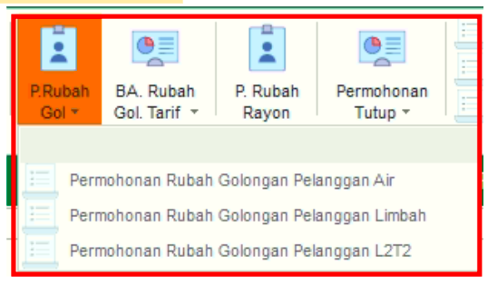
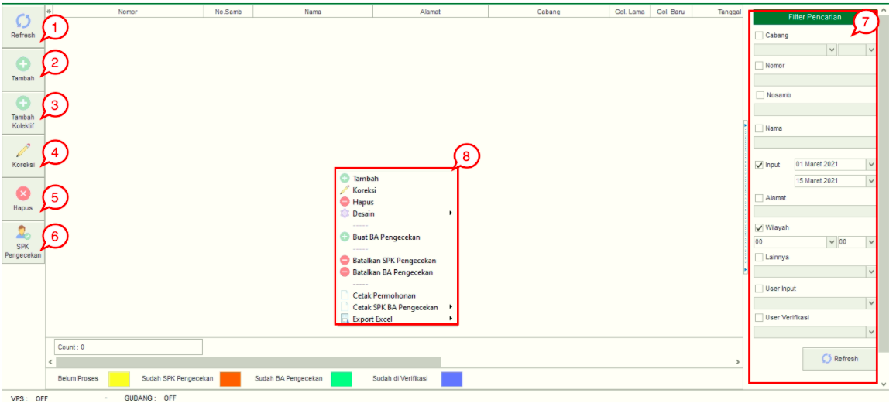
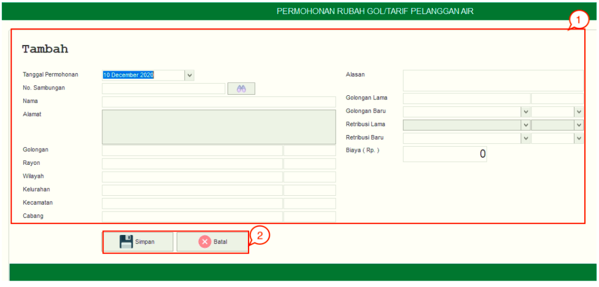
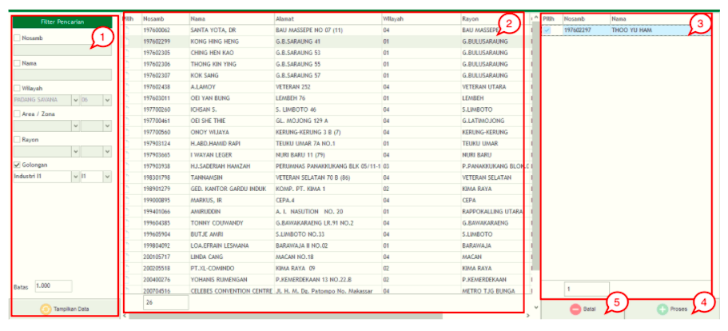

= Mengelola Permohonan Rubah Golongan

*Fitur Permohonan Rubah Golongan* digunakan untuk proses pengubahan golongan pelanggan. Berikut adalah penjelasan mengenai tombol dan _field_ pada sub-fitur:

1. *Permohonan Rubah Golongan Pelanggan Air* untuk membuat, memperbarui dan menghapus Permohonan Golongan Pelanggan Air

2. *Permohonan Rubah Golongan Pelanggan Limbah* untuk membuat, memperbarui dan menghapus Permohonan Golongan Pelanggan Limbah

3. *Permohonan Rubah Golongan Pelanggan L2T2* untuk membuat, memperbarui dan menghapus Permohonan Golongan Pelanggan L2T2

Di dalam 3 sub-menu tersebut memiliki fitur *Refresh*, *Tambah*, *Tambah Kolektif*, *Koreksi* , *Hapus* dan *SPK Pengecekan*. Berikut untuk penjelasan masing-masing fitur : 

1. *Refresh Permohonan Rubah Golongan*
+
Tombol *Refresh* digunakan untuk memperbarui data Permohonan Rubah Golongan sesuai menu yang dipilih yang mungkin belum masuk ketika data sudah di-_submit_.

2. *Tambah Permohonan Rubah Golongan*
+
Tombol *Tambah* Permohonan Rubah Golongan Pelanggan sesuai dengan sub-menu yang dipilih. Berikut cara untuk menambah data baru Permohonan Balik Nama Pelanggan Air:
+

+
[arabic]
. Isi *form yang tersedia* pada menu tambah data Permohonan Rubah Golongan Pelanggan Air
. Klik *tombol* Simpan untuk menambahkan data Permohonan Rubah Golongan Pelanggan Air yang baru. Tombol *Batal* digunakan untuk melakukan cancel pada data yang akan ditambahkan.

3. *Tambah Kolektif Permohonan Rubah Golongan*
+
Tombol *Tambah Kolektif* digunakan untuk menambahkan lebih dari satu data Permohonan Rubah Golongan. Berikut cara untuk menambah data secara kolektif: 
+

+
[arabic]
. Pilih filter untuk menampilkan data sesuai dengan filter yang ditampilkan
. Setelah data sesuai filter ditampilkan, kemudian pilih data dari list  yang ingin ditambahkan secara kolektif
. Data yang sudah dipilih dari daftar akan tampil dan membentuk _list_ sendiri sesuai dengan gambar nomor 3
. Klik Tombol *Proses* untuk memproses tambah data secara kolektif 
. Klik Tombol *Batal* jika ingin membatalkan tambah data secara kolektif

4. *Koreksi Permohonan Rubah Golongan*
+
Tombol *Koreksi* digunakan untuk melakukan koreksi pada data Permohonan Rubah Golongan sesuai dengan sub-menu yang dipilih. Untuk melakukan Koreksi, Anda dapat memilih data pada daftar, kemudian klik tombol *Koreksi*.

5. *Hapus Permohonan Rubah Golongan*
+
Tombol *Hapus* digunakan untuk menghapus data. Untuk menghapus data, Anda dapat memilih data pada daftar, kemudian klik tombol *Hapus*.

6. *SPK Pengecekan Permohonan Rubah Golongan*
+
Tombol SPK Pengecekan digunakan untuk memproses SPK Permohonan Ruba Golongan Pelanggan sesuai dengan submenu yang dipilih.

7. *Filter Permohonan Rubah Golongan*
+
Field *Filter* digunakan untuk mencari data Permohonan Rubah Golongan Pelanggan sesuai dengan submenu yang dipilih sesuai dengan kebutuhan. Untuk melakukan pencarian data, Anda dapat mengisi _form_ sesuai dengan _field_ yang sudah ditentukan kemudian *Refresh*.

8. *Action Menu saat diklik kanan*
+
Anda dapat melakukan klik kanan pada _row_ data Permohonan Rubah Golongan Pelanggan sesuai dengan submenu yang dipilih untuk menampilkan _action menu_. Berikut adalah penjelasan untuk masing-masing _action menu_: 

- *Tambah*: Untuk menambah data Permohonan Rubah Golongan Pelanggan
- *Koreksi*: Untuk melakukan koreksi (edit) terhadap data Permohonan Rubah Golongan Pelanggan yang dipilih
- *Hapus*: Untuk menghapus data yang Permohonan Rubah Golongan Pelanggan yang dipilih
- *Buat BA Pengecekan*: Untuk membuat Berita Acara Pengecekan
- *Batalkan SPK Pengecekan*: Untuk membatalkan SPK Pengecekan dari data yang dipilih
- *Batalkan BA Pengecekan*: Untuk membatalkan Berita Acara dari data yang dipilih
- *Cetak Permohonan*: Untuk mencetak Permohonan Rubah Golongan Pelanggan 
- *Cetak SPK BA Pengecekan*: Untuk Mencetak SPK maupun Berita Acara Pengecekan
- *Export Excel*: Untuk _export_ data yang dipilih ke format Excel