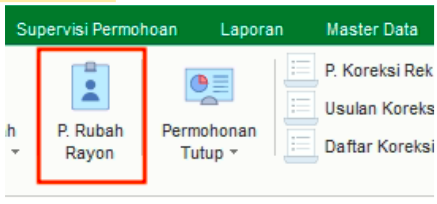
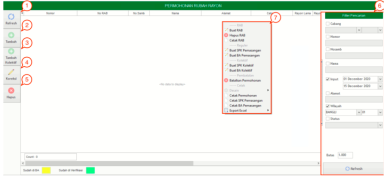
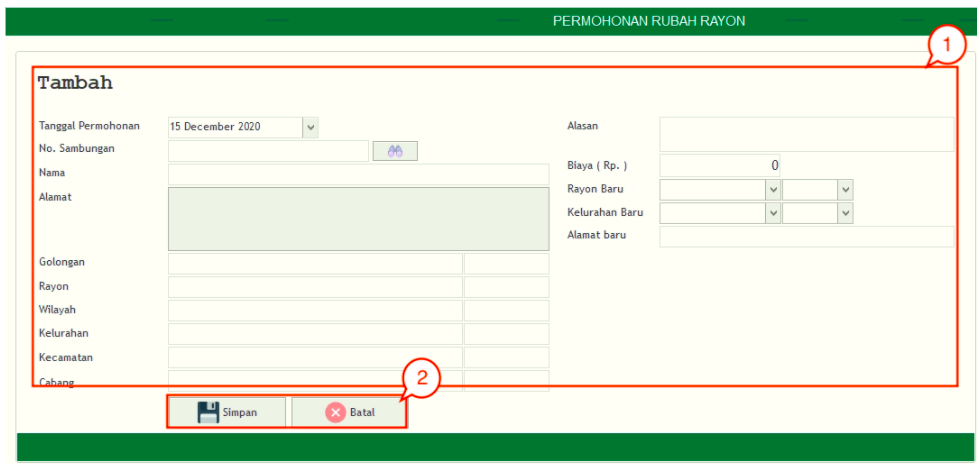
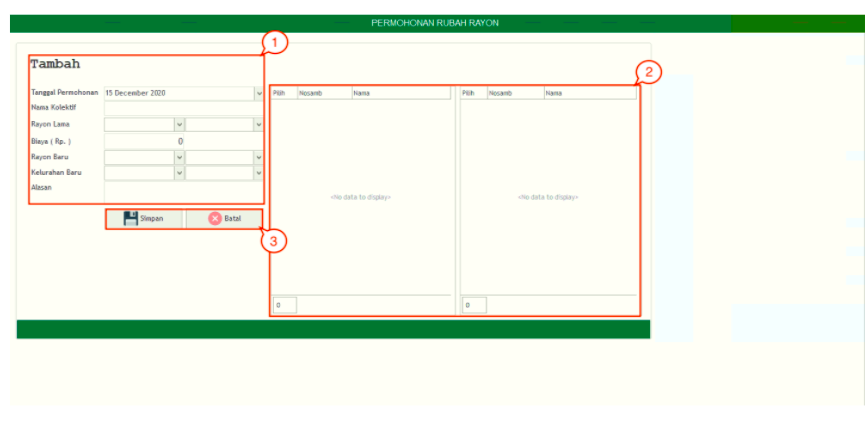

= Mengelola Permohonan Rubah Rayon

Fitur *Permohonan Rubah Rayon* digunakan untuk memenuhi permintaan atau permohonan merubah rayon dari pelanggan. Proses perubahan rayon bisa dilakukan secara langsung meskipun masih terdapat piutang. Berikut adalah penjelasan mengenai fitur Permohonan Rubah Rayon:

1. *Refresh Permohonan Rubah Rayon*
+
Tombol *Refresh* digunakan untuk memperbarui data Permohonan Rubah Rayon yang mungkin belum masuk ketika data sudah di-_submit_.

2. *Tambah Permohonan Rubah Rayon*
+
Tombol *Tambah* digunakan untuk menambah data baru Permohonan Rubah Rayon. Berikut adalah cara untuk menambah data baru Permohonan Rubah Rayon: 
+

+
[arabic]
. Isi *form yang tersedia* pada menu tambah data Permohonan Rubah Rayon
. Klik tombol *Simpan* untuk menambahkan data Permohonan Rubah Rayon yang baru. Tombol *Batal* digunakan untuk melakukan cancel pada data yang akan ditambahkan.

3. *Tambah Kolektif Permohonan Rubah Rayon*
+
Tombol *Tambah Kolektif* Permohonan Rubah Rayon digunakan untuk menambah data baru Permohonan Rubah Rayon secara kolektif (_bulk_). Berikut cara untuk menambah data baru Permohonan Rubah Rayon secara kolektif: 
+

+
[arabic]
. Isi *form yang tersedia* pada menu tambah data Permohonan Rubah Rayon 
. Cek data pada kolom yang telah disediakan
. Klik tombol *Simpan* untuk menambahkan data Permohonan Rubah Rayon yang baru. Tombol *Batal* digunakan untuk melakukan cancel pada data yang akan ditambahkan.

4. *Koreksi Permohonan Rubah Rayon*
+
Tombol *Koreksi* digunakan untuk melakukan koreksi pada data Permohonan Rubah Rayon. Untuk melakukan Koreksi, Anda dapat memilih data pada daftar, kemudian klik tombol *Koreksi*.

5. *Hapus Permohonan Rubah Rayon*
+
Tombol *Hapus* digunakan untuk menghapus data Permohonan Rubah Rayon dalam List. Untuk menghapus data, Anda dapat memilih data pada daftar, kemudian klik tombol *Hapus*.

6. *Filter Permohonan Rubah Rayon*
+
Field *Filter* digunakan untuk mencari data Permohonan Rubah Rayon sesuai dengan kebutuhan. Untuk melakukan pencarian data, Anda dapat mengisi _form_ sesuai dengan _field_ yang sudah ditentukan kemudian *Refresh*.

7. *Action Menu saat diklik kanan*
+
Anda dapat melakukan klik kanan pada _row_ data Permohonan Rubah Rayon untuk menampilkan _action menu_. Berikut adalah penjelasan untuk masing-masing _action menu_: 

- *Buat RAB*: Untuk membuat RAB pada data yang dipilih
- *Hapus RAB*: Untuk menghapus RAB pada data yang dipilih
- *Cetak RAB*: Untuk mencetak RAB pada data yang dipilih
- *Buat SPK Pemasangan*: Untuk membuat SPK Pemasangan pada data yang dipilih
- *Buat BA Pemasangan*: Untuk membuat BA Pemasangan pada data yang dipilih
- *Buat SPK Kolektif*: Untuk membuat SPK Kolektif pada data yang dipilih
- *Buat BA Kolektif*: Untuk membuat BA Kolektif pada data yang dipilih
- *Batalkan Permohonan*: Untuk membatalkan Permohonan pada data yang dipilih
- *Cetak Permohonan*: Untuk mencetak Permohonan Rubah Rayon
- *Cetak SPK Pemasangan*: Untuk mencetak SPK Pemasangan
- *Cetak BA Pemasangan*: Untuk mencetak BA Pemasangan
- *Export Excel*: Untuk _export_ data yang dipilih ke format Excel