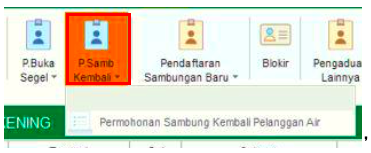
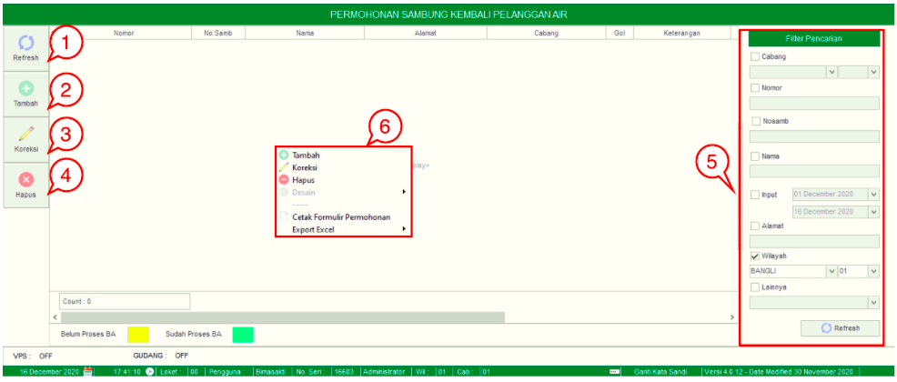
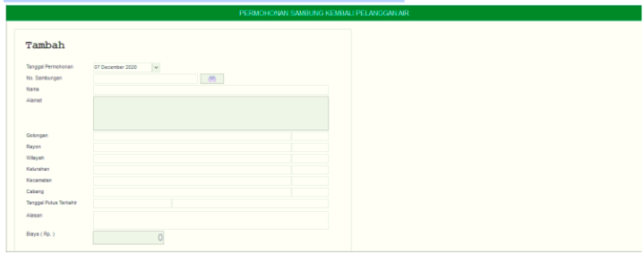

= Mengelola Permohonan Sambung Kembali

Fitur *Permohonan Sambung Kembali Pelanggan Air* meliputi Tombol *Refresh*, *Tambah*, *Koreksi*, *Hapus*, *Filter Pencarian*, dan *Action Button*. Berikut untuk detail fitur Permohonan Sambung Kembali Pelanggan Air  : 

1. *Refresh Permohonan Sambung Kembali Pelanggan Air*
+
Tombol *Refresh* digunakan untuk memperbarui data *Permohonan Sambung Kembali Pelanggan Air* yang mungkin belum masuk ketika data sudah di-_submit_

2. *Tambah Permohonan Sambung Kembali Pelanggan Air*
+
Tombol *Tambah* digunakan untuk menambah data baru permohonan. Berikut cara untuk menambah data baru Permohonan Sambung Kembali Pelanggan Air: 
+

+
[arabic]
. Lengkapi *form yang tersedia* untuk menambahkan data baru pada Permohonan Sambung Kembali Pelanggan Air. 
. Kemudian klik tombol *Simpan*.

3. *Koreksi Permohonan Sambung Kembali Pelanggan Air*
+
Tombol *Koreksi* digunakan untuk melakukan koreksi pada data  *Permohonan Sambung Kembali Pelanggan Air*. Untuk melakukan Koreksi, Anda dapat memilih data pada daftar, kemudian klik tombol *Koreksi*.

4. *Hapus Permohonan Sambung Kembali Pelanggan Air*
+
Tombol *Hapus* digunakan untuk menghapus data *Permohonan Buka Sambung Kembali Pelanggan Air* dari daftar. Untuk menghapus data, Anda dapat memilih data pada daftar, kemudian klik tombol *Hapus*.

5. *Filter Pencarian Permohonan Sambung Kembali Pelanggan Air*
Field *Filter* digunakan untuk mencari data *Permohonan Sambung Kembali Pelanggan Air* sesuai dengan kebutuhan. Untuk melakukan pencarian data *Permohonan Sambung Kembali Pelanggan Air* bisa dilakukan dengan cara mengisi form sesuai dengan field yang sudah ditentukan kemudian klik tombol *Refresh*.

6. *Action Menu saat di klik kanan* 
Anda dapat melakukan klik kanan pada _row_ data Permohonan Sambung Kembali Pelanggan Air untuk menampilkan _action menu_. Berikut adalah penjelasan untuk masing-masing _action menu_: 

- *Tambah* : Menu Refresh digunakan untuk memperbarui data Permohonan Sambung Kembali Pelanggan Air yang mungkin belum masuk ketika data sudah di-_submit_.
- *Koreksi* : Menu Koreksi digunakan untuk melakukan koreksi pada data Permohonan Sambung Kembali Pelanggan Air. Untuk melakukan Koreksi Anda dapat memilih data yang akan dikoreksi, kemudian klik tombol *Koreksi*.
- *Hapus* : Menu Hapus digunakan untuk menghapus data Permohonan Sambung Kembali Pelanggan Air dalam List. Untuk menghapus data Anda dapat memilih data yang akan dihapus, kemudian klik tombol *Hapus*.
- *Cetak Formulir Permohonan* : digunakan untuk mencetak Formulir Permohonan sesuai dengan data Permohonan Sambung Kembali Pelanggan Air yang dipilih
- *Export Excel* : Untuk melakukan _export_ data Permohonan Sambung Kembali Pelanggan berupa file Excel