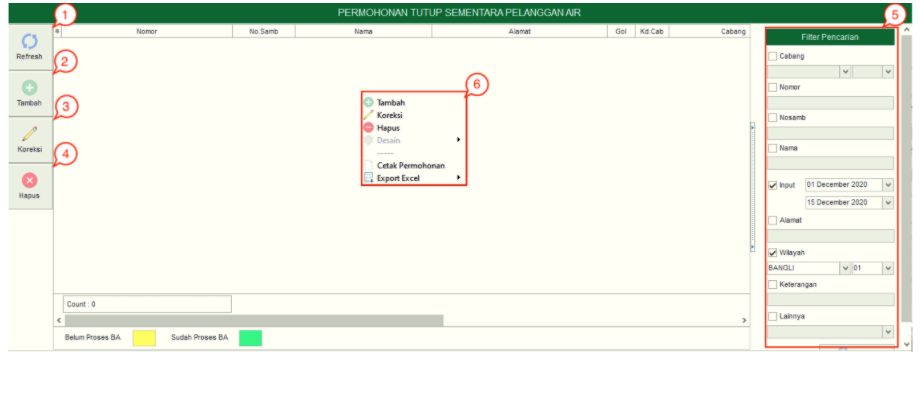
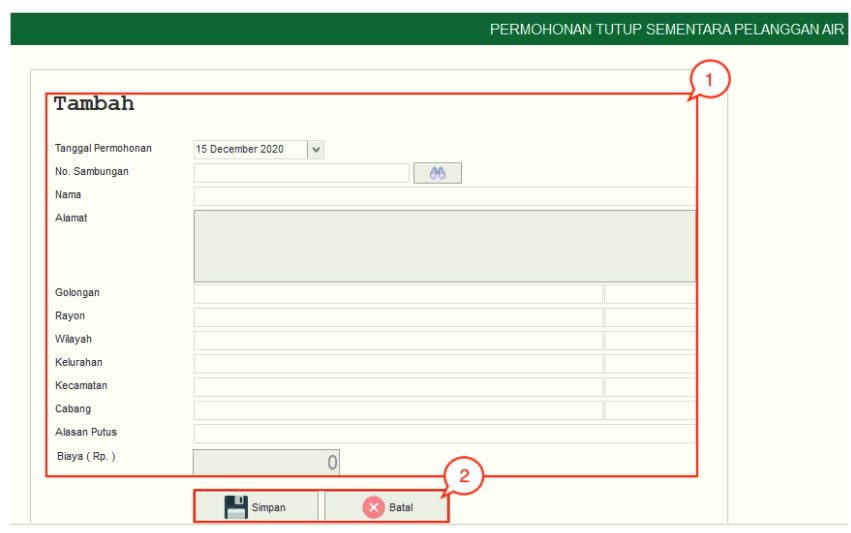

= Mengelola Permohonan Tutup Sementara Pelanggan Air

Permohonan tutup sementara adalah permohonan yang dilakukan atas dasar permohonan dari pelanggan. Pelanggan yang telah melakukan permohonan *tutup sementara* akan memiliki status tutup sementara. Permohonan tutup sementara pelanggan berstatus tutup sementara dan rekening tetap terbit setiap bulannya dan hanya akan membayar biaya beban, tidak membayar biaya pakai.

1. *Refresh Permohonan Tutup Sementara Pelanggan Air*
+
Tombol *Refresh* digunakan untuk memperbarui data Permohonan Tutup Sementara Pelanggan Air yang mungkin belum masuk ketika data sudah di-_submit_.

2. *Tambah Permohonan Tutup Sementara Pelanggan Air*
+
Tombol *Tambah* digunakan untuk menambah data baru Permohonan Tutup Sementara Pelanggan Air. Berikut cara untuk menambah data baru Permohonan Tutup Sementara Pelanggan Air: 
+ 

+
[arabic]
. Isi *form yang tersedia* pada menu tambah data Permohonan Tutup Sementara Pelanggan Air
. Klik tombol *Simpan* untuk menambahkan data Permohonan Tutup Sementara Pelanggan Air yang baru. Tombol *Batal* digunakan untuk melakukan cancel pada data yang akan ditambahkan.

3. *Koreksi Permohonan Tutup Sementara Pelanggan Air*
+
Tombol *Koreksi* digunakan untuk melakukan koreksi pada data Permohonan Tutup Sementara Pelanggan Air. Untuk melakukan Koreksi, Anda dapat memilih data pada daftar, kemudian klik tombol *Koreksi*.

4. *Hapus Permohonan Tutup Sementara Pelanggan Air*
+
Tombol *Hapus* digunakan untuk menghapus data Permohonan Tutup Sementara Pelanggan Air dalam List. Untuk menghapus data, Anda dapat memilih data pada daftar, kemudian klik tombol *Hapus*.

5. *Filter Permohonan Tutup Sementara Pelanggan Air*
+
Field *Filter* digunakan untuk mencari data Permohonan Tutup Sementara Pelanggan Air sesuai dengan kebutuhan. Untuk melakukan pencarian data , Anda dapat memilih data pada daftar, mengisi _form_ sesuai dengan _field_ yang sudah ditentukan kemudian *Refresh*.

6. *Action Menu saat diklik kanan* 
+
Anda dapat melakukan klik kanan pada _row_ data Permohonan Tutup Sementara Pelanggan Air untuk menampilkan _action menu_. Berikut adalah penjelasan untuk masing-masing _action menu_: 

- *Tambah*: Untuk menambah data Permohonan Tutup Sementara Pelanggan Air
- *Koreksi*: Untuk melakukan koreksi (edit) terhadap Permohonan Tutup Sementara Pelanggan Air yang dipilih
- *Hapus*: Untuk menghapus data yang Permohonan Tutup Sementara Pelanggan Air yang dipilih
- *Cetak Permohonan*: Untuk mencetak Permohonan Tutup Sementara Pelanggan Air
- *Export Excel*: Untuk _export_ data yang dipilih ke format Excel