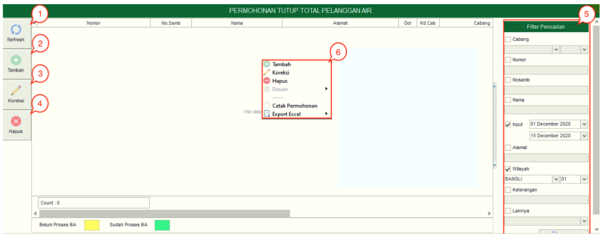
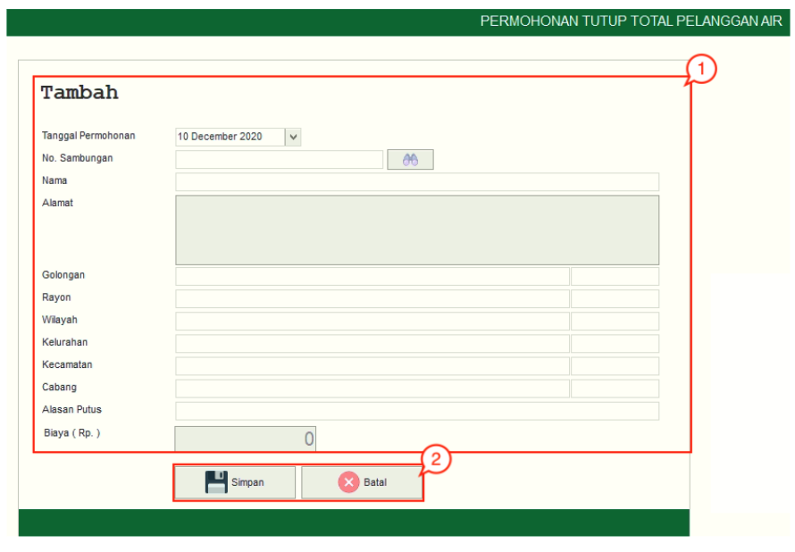

= Mengelola Permohonan Tutup Total Pelanggan Air

*Permohonan Tutup Total* adalah permohonan yang dilakukan atas dasar permohonan dari pelanggan. Pelanggan yang telah melakukan permohonan tutup sementara akan memiliki *status "nonaktif"*. Permohonan tutup sementara pelanggan berstatus nonaktif dan rekeningnya tidak terbit. Berikut adalah penjelasan mengenai masing-masing sub-fitur Permohonan Tutup Total Pelanggan Air:

1. *Refresh Permohonan Tutup Total Pelanggan Air*
+
Tombol *Refresh* digunakan untuk memperbarui data Permohonan Tutup Total Pelanggan Air  yang mungkin belum masuk ketika data sudah di-_submit_.

2. *Tambah Permohonan Tutup Total Pelanggan Air*
+
Tombol *Tambah* digunakan untuk menambah data baru Permohonan Tutup Total Pelanggan Air. Berikut cara untuk menambah data baru Permohonan Tutup Total Pelanggan Air: 
+

+
[arabic]
. Isi *form yang tersedia* pada menu tambah data Permohonan Tutup Total Pelanggan Air 
. Klik tombol *Simpan* untuk menambahkan data Permohonan Tutup Total Pelanggan Air yang baru. Tombol Batal digunakan untuk melakukan cancel pada data yang akan ditambahkan.

3. *Koreksi Permohonan Tutup Total Pelanggan Air*
+ 
Tombol *Koreksi* digunakan untuk melakukan koreksi pada data Permohonan Tutup Total Pelanggan Air. Untuk melakukan Koreksi, Anda dapat memilih data pada daftar, kemudian klik tombol *Koreksi*.

4. *Hapus Permohonan Balik Nama Pelanggan Air*
+
Tombol *Hapus* digunakan untuk menghapus data Permohonan Tutup Total Pelanggan Air dalam List. Untuk menghapus data, Anda dapat memilih data pada daftar, kemudian klik tombol *Hapus*.

5. *Filter Permohonan Tutup Total  Pelanggan Air* 
+
Field *Filter* digunakan untuk mencari data Permohonan Tutup Total Pelanggan Air sesuai dengan kebutuhan. Untuk melakukan pencarian data, Anda dapat mengisi _form_ sesuai dengan _field_ yang sudah ditentukan kemudian *Refresh*.

6. *Action Menu saat diklik kanan*
Anda dapat melakukan klik kanan pada _row_ data Permohonan Tutup Total Pelanggan Air untuk menampilkan _action menu_. Berikut adalah penjelasan untuk masing-masing _action menu_:

- *Tambah*: Untuk menambah data Permohonan Tutup Total Pelanggan Air
- *Koreksi*: Untuk melakukan koreksi (edit) terhadap data Permohonan Tutup Total Pelanggan Air yang dipilih
- *Hapus*: Untuk menghapus data yang Permohonan Tutup Total Pelanggan Air yang dipilih
- *Cetak Permohonan*: Untuk mencetak Permohonan Tutup Total Pelanggan Air
- *Export Excel*: Untuk _export_ data yang dipilih ke format Excel