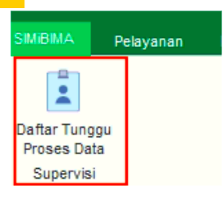
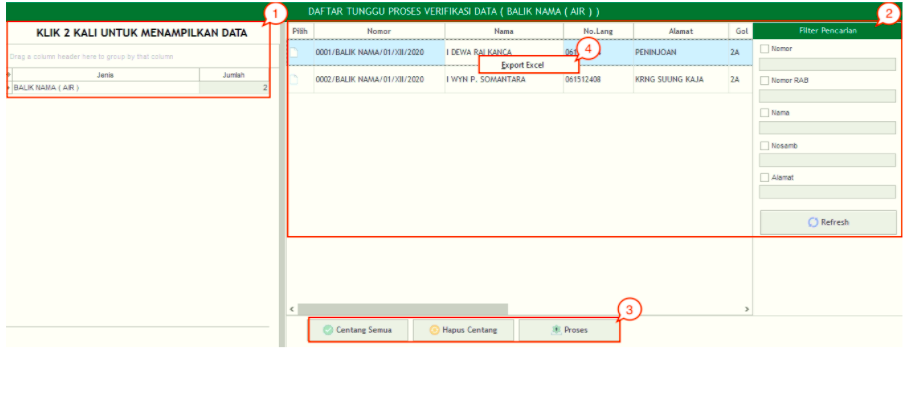

= Menampilan Daftar Tunggu Proses Data

Fitur ini digunakan untuk menampilkan daftar tunggu proses verifikasi data (balik nama) yang masuk ke sistem.  Berikut adalah detail penjelasan tampilan fitur:

1. Klik 2 kali untuk pada *Jenis Data* untuk menampilkan data.

2. Pilih data yang hendak diproses pada dengan klik pada *kolom Pilih*. (Note: Untuk pencarian data yang spesifik, gunakan bantuan *filter*).

3. Klik tombol *Centang Semua*, apabila hendak memilih semua data atau klik pada tombol *Hapus Centang* untuk _reset_ data yang sudah dicentang. Jika data yang benar sudah dipilih, klik pada tombol *Proses* untuk memulai proses.

4. Jika diperlukan untuk _export_ data ke dalam ekstensi Excel, lakukan klik kanan kemudian klik pada action *Export Excel*.