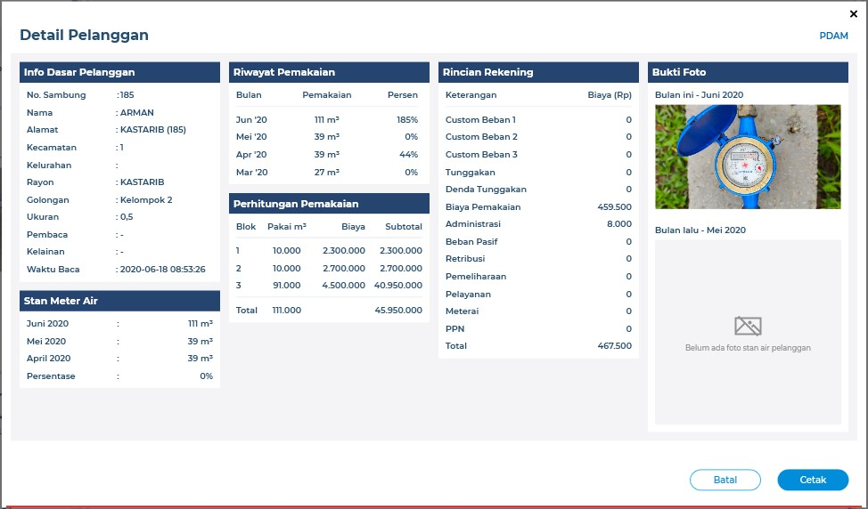

:url-repo: https://github.com/bimasaktialterra/bacameter.net/tree/master

= Flow and Wireframe Bacameter.NET

Dokumen ini berisi tentang flow dan wireframe dari sistem Bacameter, dokumen bisa di isi tentang gambar dan deskripsi dari flow dan wireferame system

== Wireframe

Kumpulan wireframe & UI assets dapat diakses pada link berikut ini

https://app.zeplin.io/project/5ef98a534fe7617f74d738f2/dashboard

Previewnya sebagai berikut

Bila membutuhkan akses wireframe dapat menghubungi tim produk berikut;

|===
| *Name* | *Role* | *Email* 
| Aulia Rahmani | UI & UX Design Lead | aulia@alterra.id 
| Mahfuzi | UI & UX Design | mahfuzi@alterra.id
|===

== Flow

Aplikasi Bacameter ini merupakan modul PDAM Pintar yang fungsionalnya secara umum untuk mengelola hasilbaca yang dilakukan

=== 1. Supervisi
Supervisi merupakan fitur utama dari aplikasi bacameter. Dimana data yang ditampilkan merupakan data yang ada pada tabel hasilbaca(MMYY) di database dengan (MMYY) merupakan periode baca yang bisa dipilih ketika pertama kali login atau diubah melalui dropdown yang disediakan di halaman utama supervisi.

==== 1.1. Tabel & Filter Hasil Baca Meteran

Tampilan tabel hasil baca merupakan hasil query ke tabel `hasilbaca(periode bulan tahun tertentu)`.

image:images/page_supervisi.png[Halaman Utama Supervisi]
{nbsp} +
{nbsp} +

==== 1.1.1 Bukti Hasil Baca

Untuk Bukti Hasil Baca terdapat 4 bagian terpisah dalam pengambilan datanya.

1. Data Foto Stan
 Data foto stan didapatkan dari folder yang telah diatur dalam tabel “setting” pada kolom “lokalfolderfoto”. Foto stan memiliki format ekstensi “.jpg”. Tata letak foto stan dapat dinyatakan sebagai berikut:

  ----
  {lokalfolderfoto}/{MMYY}/.thumbnails/{idpelanggan}.jpg
  ----
+
{MMYY} = angka pada bulan dan tahun sesuai periode yang dipilih misal periode “Januari 2020” maka folder bernama “0120”.
{idpelanggan} = Id dari pelanggan yang dipilih.

2. Data Foto Rumah
 Cara mendapatkan foto rumah sama dengan foto stan, hanya berbeda nama file saja, terdapat akhiran “R” pada nama file, seperti berikut:

 ----
 {lokalfolderfoto}/{MMYY}/.thumbnails/{idpelanggan}R.jpg
 ----

3. Data Video
 Cara mendapatkan video sama dengan foto stan, namun terdapat perbedaan, yaitu langsung didapat dari folder {MMYY} tanpa perlu masuk ke folder “.thumbnails”. File video memiliki format ekstensi “.mp4” dan terdapat akhiran “V” pada nama file, seperti berikut:

 ----
 {lokalfolderfoto}/{MMYY}/{idpelanggan}V.mp4
 ----

4. Data Stan tiap Periode
 Data stan tiap periode didapatkan dari table hasilbaca MMYY sesuai periode yang dipilih

==== 1.2. Data Periode
Data Periode yang digunakan pada tabel Supervisi adalah periode bulan dan tahun dari tabel hasilbaca pada database. Data Periode ini disajikan dalam bentuk opsi dropdown di UI.

Adapun query untuk mendapatkan data periode ini dapat dilihat pada link:{url-repo}/bacameter/Services/Periode.cs#L19-L24[link berikut].

{nbsp} +

==== 1.3. Operasi Supervisi
Pada menu supervisi, kebanyakan operasi data-nya dilakukan melalui interaksi klik kanan & shortcut.

{nbsp} +
{nbsp} +

Berikut merupakan daftar proses yang dapat dilakukan pada menu Supervisi:

==== 1.3.1. Klik Kanan Koreksi Hasil Baca
Koreksi hasil baca digunakan untuk melakukan perubahan data stan sekarang (stanskrg), jumlah pemakaian (pakaiskrg), stan angkat (stanangkat), rayon, golongan, dan kelainan. Pada sistem database, dilakukan update flag sudahbaca, waktubaca, iduserupdate, dan flagkoreksi saat proses simpan, pada suatu row yang dipilih.

query yang dijalankan ketika proses koreksi hasilbaca, dapat dilihat pada link:{url-repo}/bacameter/Services/Supervisi/KoreksiHasilBaca.cs#L52-L136[link berikut].
sedangkan logic yang digunakan dapat dilihat pada view class dan view model pada link:{url-repo}/bacameter/Views/Components/Supervisi/TabelSupervisiView.xaml.cs#L1721-L1843[link berikut] 

Berikut form Koreksi Hasil Baca yang ditampilkan ke user.

==== 1.3.2. Klik Kanan Flag Koreksi
==== 1.3.2.1. Taksasi
Menu Taksasi digunakan untuk mengubah stan pakai sekarang (stanskrg) menjadi sama dengan stan pakai bulan lalu (stanlalu), dan melakukan update flagkoreksi pada database. Tidak ada form khusus pada proses ini, hanya konfirmasi sebelum proses dijalankan.

query yang dijalankan ketika proses flag Taksasi, dapat dilihat pada link:{url-repo}/bacameter/Services/Supervisi/Taksasi.cs#L9[link berikut].
sedangkan logic yang digunakan dapat dilihat pada view class dan view model pada link:{url-repo}/bacameter/Views/Components/Supervisi/TabelSupervisiView.xaml.cs#L1886-L2019[link berikut] 

==== 1.3.2.2. Meter Terbalik
Meter Terbalik melakukan proses ubah nilai stan pemakaian bulan ini (pakaiskrg) menjadi absolute (non-negative), jika nilai pemakaian stan bulan ini bernilai negatif, maka dengan trigger menu meter terbalik ini, nilainya akan diubah menjadi positif. Selain itu, meter terbalik juga melakukan perubahan untuk flag di field flagkoreksi menjadi = 2 (Meter Terbalik).

query yang dijalankan ketika proses ini, dapat dilihat pada link:{url-repo}/bacameter/Services/Supervisi/MeterTerbalik.cs#L11-L37[link berikut].
sedangkan logic yang digunakan dapat dilihat pada view class dan view model pada link:{url-repo}/bacameter/Views/Components/Supervisi/TabelSupervisiView.xaml.cs#L2044-L2180[link berikut] 

==== 1.3.2.3. Taksasi Pemakaian
Taksasi Pemakaian melakukan proses ubah nilai stan pemakaian bulan ini (pakaiskrg) menjadi nilai yang diinput oleh user pada form yang disediakan. Selain itu, taksasi pemakaian juga melakukan perubahan untuk flag di field flagkoreksi menjadi = 3. 

query yang dijalankan ketika proses ini, dapat dilihat pada link:{url-repo}/bacameter/Services/Supervisi/TaksasiPemakaian.cs#L8-L36[link berikut].
sedangkan logic yang digunakan dapat dilihat pada view class dan view model pada link:{url-repo}/bacameter/Views/Components/Supervisi/TabelSupervisiView.xaml.cs#L2226-L2358[link berikut] 

Syarat untuk melakukan proses Taksasi Pemakaian adalah:

- data hasilbaca berstatus sudah dibaca
- data hasilbaca berstatus belum di-verifikasi

Berikut form Taksasi Pemakaian yang ditampilkan ke user.

==== 1.3.3. Klik Kanan Detail Pelanggan (Shortcut Ctrl+Enter)
Menu ini berfungsi untuk menampilkan detail pelanggan pada suatu row di tabel yang sedang di-highlight. Pada tampilan detail pelanggan ini, user juga dapat melakukan cetak data pelanggan.

Untuk logic cetak data pelanggan ini, dapat dilihat pada link:{url-repo}/bacameter/Views/Components/Supervisi/TabelSupervisiView.xaml.cs#L2383-L2409[link berikut] 

==== 1.3.4. Klik Kanan Verifikasi (Shortcut F2)
Proses Verifikasi melakukan perubahan value pada field "verifikasi" dari "0" menjadi "1" untuk data yang dipilih.

query yang dijalankan ketika proses ini, dapat dilihat pada link:{url-repo}/bacameter/Services/Supervisi/Verifikasi.cs#L10-L35[link berikut].
sedangkan logic yang digunakan dapat dilihat pada view class dan view model pada link:{url-repo}/bacameter/Views/Components/Supervisi/TabelSupervisiView.xaml.cs#L2439-L2467[link berikut] 

==== 1.3.5. Klik Kanan Un-Verifikasi (Shortcut F4)
Proses Un-Verifikasi melakukan perubahan value pada field "verifikasi" dari "1" menjadi "0" untuk data yang dipilih.

query yang dijalankan ketika proses ini, dapat dilihat pada link:{url-repo}/bacameter/Services/Supervisi/Unverifikasi.cs#L10-L39[link berikut].
sedangkan logic yang digunakan dapat dilihat pada view class dan view model pada link:{url-repo}/bacameter/Views/Components/Supervisi/TabelSupervisiView.xaml.cs#L2497-L2526[link berikut] 

==== 1.3.6. Klik Kanan Set Sudah Upload (Shortcut F8)
Set Sudah Upload ini mengubah flag pada field "flagsudahupload" dari "0" menjadi "1". Pun sebaliknya ketika data telah memiliki flagsudahupload = 1, maka menu ini akan berubah menjadi "Set Belum Upload", untuk mengembalikan nilai "1" menjadi "0" kembali pada field "flagsudahupload".

query yang dijalankan ketika proses ini, dapat dilihat pada link:{url-repo}/bacameter/Services/Supervisi/SetUpload.cs#L9-L37[link berikut].
sedangkan logic yang digunakan dapat dilihat pada view class dan view model pada link:{url-repo}/bacameter/Views/Components/Supervisi/TabelSupervisiView.xaml.cs#L2553-L2583[link berikut] 

==== 1.3.7. Klik Kanan Set Water Meter
Set Water Meter melakukan update pada field "wm" di tabel hasilbaca(MMYY) sesuai data yang dipilih oleh user.

Adapun form yang disajikan kepada user adalah seperti berikut:

query yang dijalankan ketika proses ini, dapat dilihat pada link:{url-repo}/bacameter/Services/Supervisi/WaterMeter.cs#L11-L37[link berikut].
sedangkan logic yang digunakan dapat dilihat pada view class dan view model pada link:{url-repo}/bacameter/Views/Components/Supervisi/TabelSupervisiView.xaml.cs#L2605-L2639[link berikut] 

==== 1.3.8. Klik Kanan Set Ulang Rayon
Set Ulang Rayon digunakan untuk melakukan proses perubahan Rayon pada suatu data hasil baca di tabel hasilbaca(MMYY).

Adapun form yang disajikan kepada user adalah seperti berikut:

query yang dijalankan ketika proses ini, dapat dilihat pada link:{url-repo}/bacameter/Services/Supervisi/SetRayon.cs#L14-L43[link berikut].
sedangkan logic yang digunakan dapat dilihat pada view class dan view model pada link:{url-repo}/bacameter/Views/Components/Supervisi/TabelSupervisiView.xaml.cs#L2668-L2702[link berikut] 

==== 1.3.9. Klik Kanan Set Stan Awal
Set Stan Awal digunakan untuk mengubah nilai pada field "stanlalu".

Adapun form yang disajikan kepada user adalah seperti berikut:

query yang dijalankan ketika proses ini, dapat dilihat pada link:{url-repo}/bacameter/Services/Supervisi/SetStanAwal.cs#L11-L40[link berikut].
sedangkan logic yang digunakan dapat dilihat pada view class dan view model pada link:{url-repo}/bacameter/Views/Components/Supervisi/TabelSupervisiView.xaml.cs#L2748-L2884[link berikut] 

==== 1.3.10. Klik Kanan Set Stan Kembali Muda
Set Stan Kembali Muda digunakan untuk mengubah nilai stan menjadi nilai awal.

query yang dijalankan ketika proses ini, dapat dilihat pada link:{url-repo}/bacameter/Services/Supervisi/SetStanKembaliMuda.cs#L15-L84[link berikut].
sedangkan logic yang digunakan dapat dilihat pada view class dan view model pada link:{url-repo}/bacameter/Views/Components/Supervisi/TabelSupervisiView.xaml.cs#L2923-L3086[link berikut] 

==== 1.3.11. Klik Kanan Set Custom Beban
Set Custom Beban digunakan untuk mengubah nilai pada field "custombeban1", "custombeban2", "custombeban3", serta melakukan kalkulasi ulang pada field "totalrekening".

Adapun form yang disajikan kepada user adalah seperti berikut:

query yang dijalankan ketika proses ini, dapat dilihat pada link:{url-repo}/bacameter/Services/Supervisi/CustomBeban.cs#L10-L46[link berikut].
sedangkan logic yang digunakan dapat dilihat pada view class dan view model pada link:{url-repo}/bacameter/Views/Components/Supervisi/TabelSupervisiView.xaml.cs#L3136-L3175[link berikut] 

==== 1.3.12. Klik Kanan Hapus Hasil Baca
Hapus Hasil Baca digunakan untuk menghapus data hasil baca untuk data yang dipilih. Penghapusan disini bersifat "soft-delete", dimana data tidak akan benar-benar dihapus pada database, melainkan value nya akan di reset menjadi nilai awal (stan 0, status default, dsb).

Syarat untuk melakukan penghapusan hasil baca adalah:

- Data yang akan dihapus harus berstatus sudah dibaca

query yang dijalankan ketika proses ini, dapat dilihat pada link:{url-repo}/bacameter/Services/Supervisi/HapusHasilBaca.cs#L10-L85[link berikut].
sedangkan logic yang digunakan dapat dilihat pada view class dan view model pada link:{url-repo}/bacameter/Views/Components/Supervisi/TabelSupervisiView.xaml.cs#L3241-L3273[link berikut] 

==== 1.3.13. Klik Kanan Set Tidak Aktif
Set Tidak Aktif ini mengubah flag pada field "flagaktif" dari "1" menjadi "0". Pun sebaliknya ketika data telah memiliki flagaktif = 0, maka menu ini akan berubah menjadi "Set Aktif", untuk mengembalikan nilai "0" menjadi "1" kembali pada field "flagaktif".

query yang dijalankan ketika proses ini, dapat dilihat pada link:{url-repo}/bacameter/Services/Supervisi/SetAktif.cs#L9-L37[link berikut].
sedangkan logic yang digunakan dapat dilihat pada view class dan view model pada link:{url-repo}/bacameter/Views/Components/Supervisi/TabelSupervisiView.xaml.cs#L3295-L3325[link berikut] 

==== 1.3.14. Klik Kanan Lihat Hasil Baca Ulang
Lihat Hasil Baca Ulang dapat digunakan ketika data memiliki status pada field "peruntukan" = "2". Dimana lihat hasil baca ulang ini akan aktif ketika aplikasi mobile telah mengirimkan hasil baca ulang yang diminta. Menu ini berkaitan dengan Permintaan Baca Ulang.

query yang dijalankan ketika proses ini, dapat dilihat pada link:{url-repo}/bacameter/Services/Supervisi/HasilBacaUlang.cs#L38-L169[link berikut].
sedangkan logic yang digunakan dapat dilihat pada view class dan view model pada link:{url-repo}/bacameter/Views/Components/Supervisi/TabelSupervisiView.xaml.cs#L3353-L3395[link berikut] 

==== 1.3.15. Klik Kanan Permintaan Baca Ulang
Ketika Hasil Baca dirasa kurang jelas, maka user dapat melakukan permintaan baca ulang, Permintaan baca ulang akan mengubah status pada field "peruntukan" menjadi = "1". Untuk kemudian diproses oleh aplikasi mobile, dan dari aplikasi mobile, akan mengirimkan hasil baca ulang kemudian mengubah flag "peruntukan" menjadi = "2", yang kemudian bersambung ke menu Lihat Hasil Baca Ulang di atas.

query yang dijalankan ketika proses ini, dapat dilihat pada link:{url-repo}/bacameter/Services/Supervisi/PermintaanBacaUlang.cs#L10-L46[link berikut].
sedangkan logic yang digunakan dapat dilihat pada view class dan view model pada link:{url-repo}/bacameter/Views/Components/Supervisi/TabelSupervisiView.xaml.cs#L3414-L3453[link berikut] 

==== 1.3.16. Klik Kanan Isi Lampiran
Lampiran disini bersifat seperti catatan, dimana user dapat memberikan catatan khusus pada data tertentu menggunakan menu ini.

Adapun form yang disajikan kepada user adalah seperti berikut:

query yang dijalankan ketika proses ini, dapat dilihat pada link:{url-repo}/bacameter/Services/Supervisi/Lampiran.cs#L41-L68[link berikut].
sedangkan logic yang digunakan dapat dilihat pada view class dan view model pada link:{url-repo}/bacameter/Views/Components/Supervisi/TabelSupervisiView.xaml.cs#L3489-L3523[link berikut] 

{nbsp} +
{nbsp} +

=== 2. Produktivitas
Menu Produktivitas merupakan menu yang digunakan untuk menampilkan laporan/report data hasil baca untuk periode yang dipilih pada menu Supervisi.

Adapun semua proses query untuk mendapatkan laporan yang disajikan pada grafik, dapat dilihat pada link:{url-repo}/bacameter/Services/Produktivitas[link berikut].

{nbsp} +
{nbsp} +

=== 3. Pemetaan Pelanggan
Tampilan daftar pelanggan berupa map yang bisa difilter berdasarkan wilayah tertentu.

Adapun untuk datanya, pada menu ini hanya dilakukan operasi SELECT, tanpa adanya CRUD.
query yang dijalankan dapat dilihat pada link:{url-repo}/bacameter/Services/PemetaanPelanggan/PemetaanPelanggan.cs#L11-L48[link berikut].

{nbsp} +
{nbsp} +

=== 4. Sistem Kontrol
Sistem Kontrol merupakan menu yang digunakan untuk melakukan konfigurasi data master yang akan diolah pada menu Supervisi,  Produktifitas, maupun Pemetaan Pelanggan.

==== 4.1. Master Database
Master Database merupakan sub-menu yang dimiliki Sistem Kontrol. Dimana menu ini berisikan 6 sub-menu untuk mengatur data: (1) Rute Baca Meter; (2) Wilayah Administrasi; (3) Tarif & Golongan; (4) Petugas Baca; (5) Daftar Kelainan; dan (6) Data Pelanggan;

==== 4.1.1 Rute Baca Meter
Rute Baca Meter memiliki 2 sub-menu lagi, yakni menu (1) Data Rayon; dan (2) Petugas Baca. Dimana masing-masing digunakan untuk pendelegasian petugas baca di tiap rayon, dimana pada menu pertama, kita dapat mendelegasikan seorang petugas pada suatu rayon. Sedangkan pada menu kedua, kita dapat mendelegasikan suatu rayon pada seorang petugas.

Aturan yang berlaku adalah, satu petugas untuk satu rayon.

Berikut adalah contoh tampilan menu Rute Baca Meter

Adapun untuk data-datanya, query yang dijalankan dapat dilihat pada link:{url-repo}/bacameter/Services/SistemKontrol/RuteBaca[link berikut] dan link:{url-repo}/bacameter/Views/Components/SistemKontrol/RuteBacaView.xaml.cs#L330-L524[link berikut]

==== 4.1.2 Wilayah Administrasi
Wilayah Administrasi berisikan data wilayah yang digunakan pada menu Supervisi, Produktifitas maupun Pemetaan Pelanggan. Terdapat 2 sub-menu pada Wilayah Administrasi, yaitu Data Rayon dan Data Kecamatan. Data Rayon berbeda dengan menu yang ada di Rute Baca sebelumnya, dimana Data Rayon disini merupakan master data rayon (bukan pen-delegasian suatu rayon untuk seorang petugas) meliputi penamaan rayon, kode, status-nya, sedangkan menu kecamatan merupakan master data wilayah yang mencakup 3 level area yang dapat ditambah, diubah, dan dihapus oleh user. Yakni level Kecamatan, Kelurahan/Desa/Dusun, dan RTRW.

Berikut adalah contoh tampilan menu Wilayah Administrasi

Adapun untuk data-datanya, query yang dijalankan dapat dilihat pada link:{url-repo}/bacameter/Services/SistemKontrol/Wilayah[link berikut].

==== 4.1.3 Tarif & Golongan
Menu ini digunakan untuk mengolah master data Golongan, Diameter, Biaya PPN, dan Biaya Meterai.

Berikut adalah contoh tampilan menu Tarif & Golongan

Adapun untuk data-datanya, query yang dijalankan dapat dilihat pada link:{url-repo}/bacameter/Services/SistemKontrol/TarifGolongan[link berikut].

==== 4.1.4 Petugas Baca
Master Data Petugas Baca dapat diatur pada menu ini, dimana data Petugas Baca ini akan dipakai di semua menu bacameter, meliputi Supervisi, Produktivitas dan Pemetaan Pelanggan.

Berikut adalah contoh tampilan menu Petugas Baca

Adapun untuk data-datanya, query yang dijalankan dapat dilihat pada link:{url-repo}/bacameter/Services/SistemKontrol/PetugasBaca/PetugasBaca.cs#L13-L43[link berikut].

==== 4.1.5 Daftar Kelainan
Menu ini digunakan untuk mengatur Daftar Kelainan dan Kode Kelainannya, dimana Kelainan ini akan dipakai pada menu Supervisi untuk verifikasi/validasi data.

Berikut adalah contoh tampilan menu Daftar Kelainan

Adapun untuk data-datanya, query yang dijalankan dapat dilihat pada link:{url-repo}/bacameter/Services/SistemKontrol/DaftarKelainan/Kelainan.cs#L13-L40[link berikut].

==== 4.1.6 Data Pelanggan
Seperti judulnya, Data Pelanggan berisikan data nama-nama pelanggan PDAM beserta rincian-nya.

Berikut adalah contoh tampilan menu Data Pelanggan

Adapun untuk data-datanya, query yang dijalankan dapat dilihat pada link:{url-repo}/bacameter/Services/SistemKontrol/DataPelanggan[link berikut].

==== 4.2. Laporan
Menu Laporan mencakup laporan secara keseluruhan dari pelanggan/petugas baca pada suatu jadwal rute baca tertentu. Laporan disini berbeda dengan Laporan grafik yang ada di Produktivitas, dimana jika pada menu Produktivitas, Laporan yang disajikan berdasarkan periode baca yang saat ini aktif, sedangkan Laporan merupakan data secara keseluruhan dan tidak se-complex yang ada di menu Produktivitas. 

==== 4.2.1 Distribusi Pelanggan
Laporan ini menunjukkan grafik ringkasan distribusi pelanggan berdasarkan opsi dropdown yang dipilih (Per Kecamatan, Per Kelurahan, Per RT/RW, Per Blok, Per Rayon, Per Golongan, dan Per Diameter).

Berikut adalah contoh tampilan menu Distribusi Pelanggan

Adapun untuk data-datanya, query yang dijalankan dapat dilihat pada link:{url-repo}/bacameter/Services/SistemKontrol/DistribusiPelanggan[link berikut].

==== 4.2.2 Jadwal Rute Baca
Sedangkan Jadwal Rute Baca menampilkan grafik laporan jadwal baca berdasarkan Petugas Baca dan Rayon.

Berikut adalah contoh tampilan menu Jadwal Rute Baca

Adapun untuk data-datanya, query yang dijalankan dapat dilihat pada link:{url-repo}/bacameter/Services/SistemKontrol/JadwalBaca[link berikut].

==== 4.3. Atur Sistem
Menu ini disediakan untuk melakukan pengaturan sistem bacameter meliputi penambahan/penghapusan data hasil baca pada periode tertentu, hak akses pengguna, pengaturan sistem, dan modifikasi file .ini (putstamp).

==== 4.3.1 Data Pembacaan
Data Pembacaan merupakan data hasil baca untuk suatu periode tertentu. Pada database, Data Pembacaan di-representasikan dengan tabel hasilbaca(MMYY). Kita dapat menambah data hasil baca untuk periode tertentu (data inisial kosong), maupun menghapus data hasil baca untuk suatu periode tertentu melalui menu ini.

Berikut adalah contoh tampilan menu Data Pembacaan

Adapun untuk data-datanya, query yang dijalankan dapat dilihat pada link:{url-repo}/bacameter/Services/SistemKontrol/DataPembacaan[link berikut].

==== 4.3.2 SMS Gateway
- Belum ada menu untuk SMS _Gateway_

==== 4.3.3 Pengguna & Hak Akses
Pengguna pada aplikasi bacameter semua diatur melalui menu ini, termasuk hak akses untuk semua operasional yang dapat dilakukan seorang pengguna. Admin dapat menambahkan, mengubah dan menghapus serta melakukan reset password untuk pengguna bacameter.

Berikut adalah contoh tampilan menu Pengguna & Hak Akses

Adapun untuk data-datanya, query yang dijalankan dapat dilihat pada link:{url-repo}/bacameter/Services/SistemKontrol/PenggunaHakAkses/UserAkses.cs#L14-L42[link berikut].

==== 4.3.4 Pengaturan Umum
Pengaturan umum berisi pengaturan/konfigurasi yang dipakai pada aplikasi bacameter. Contohnya letak path foto meter PDAM, penjadwalan backup, custom label pada menu/form tertentu, dan sebagainya.

Berikut adalah contoh tampilan menu Pengaturan Umum

Adapun untuk data-datanya, query yang dijalankan dapat dilihat pada link:{url-repo}/bacameter/Services/SistemKontrol/PengaturanUmum/Setting.cs[link berikut].

==== 4.3.5 Pengaturan Put Stamp
Putstamp merupakan menu yang digunakan untuk mengubah value yang ada pada file customize.ini sesuai aplikasi bacameter sebelumnya. Dimana file customize.ini berisikan data-data konfigurasi tambahan di luar aplikasi yang ingin dipakai pada suatu proses di dalam aplikasi bacameter.

Berikut adalah contoh tampilan menu Putstamp

Tidak ada aksi query ke database, menu putstamp hanya melakukan read/write file customize.ini. Untuk mekanisme-nya dapat dilihat pada link:{url-repo}/bacameter/Views/Components/SistemKontrol/PutstampView.xaml.cs#L104[link berikut] dan link:{url-repo}/bacameter/ViewModels/Components/SistemKontrol/PutstampViewModel.cs#L47-L60[link berikut]

==== 4.3.6 Sinkronisasi
Sinkronisasi dipakai ketika kita ingin melakukan sinkronisasi data yang ada di Billing terhadap Bacameter

==== 4.4. Lain-Lain

==== 4.4.1 Perawatan Database
Menu Perawatan Database dipakai ketika kita ingin melakukan backup, optimasi, checkup, atau perbaikan database yang saat ini kita pakai pada aplikasi bacameter.

Berikut adalah contoh tampilan menu Perawatan Database

Adapun untuk datanya, proses yang dijalankan dapat dilihat pada link:{url-repo}/bacameter/ViewModels/Components/SistemKontrol/PerawatanDBViewModel.cs[link berikut].

==== 4.4.2 Log Akses User
Seluruh aktivitas pengguna aplikasi akan terekam di database dan ditampilkan pada menu ini. Menu ini bersifat informatif saja, sehingga tidak ada proses CRUD sama sekali di dalamnya.

Berikut adalah contoh tampilan menu Log Akses User

Adapun untuk data-datanya, query yang dijalankan dapat dilihat pada link:{url-repo}/bacameter/Services/SistemKontrol/LogAkses/LogAkses.cs#L12-L47[link berikut].

{nbsp} +
{nbsp} +

=== 5. Bantuan
Menu Bantuan berisikan informasi tambahan yang bermanfaat bagi user pengguna aplikasi bacameter. Terdapat 3 sub-menu pada halaman bantuan untuk saat ini, yakni (1) Cara Penggunaan; (2) FAQ; dan (3) Saran Pengaduan.

==== 5.1 Cara Penggunaan
Menu ini berisikan informasi umum pada aplikasi bacameter.

Tidak ada proses query ke database pada menu ini.

==== 5.2 FAQ
Menu ini berisi informasi permasalahan/pertanyaan yang sering kali muncul ketika mengakses menu tertentu di aplikasi bacameter,khususnya Sistem Kontrol.

Tidak ada proses query ke database pada menu ini. Untuk data pertanyaan, merupakan load data file HTML yang ada pada link:{url-repo}/bacameter/FAQ[link berikut].

==== 5.3 Saran & Pengaduan
Menu ini berguna untuk feedback aplikasi, dimana user dapat mengirimkan saran dan keluhan terkait penggunaan aplikasi Bacameter kepada Administrator.

