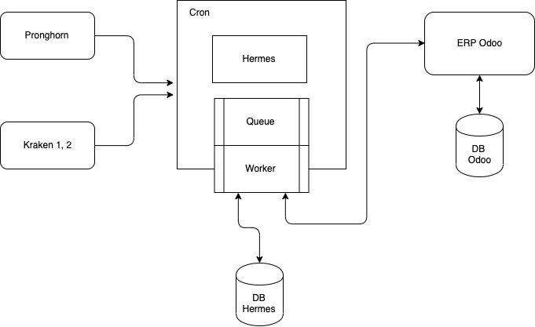
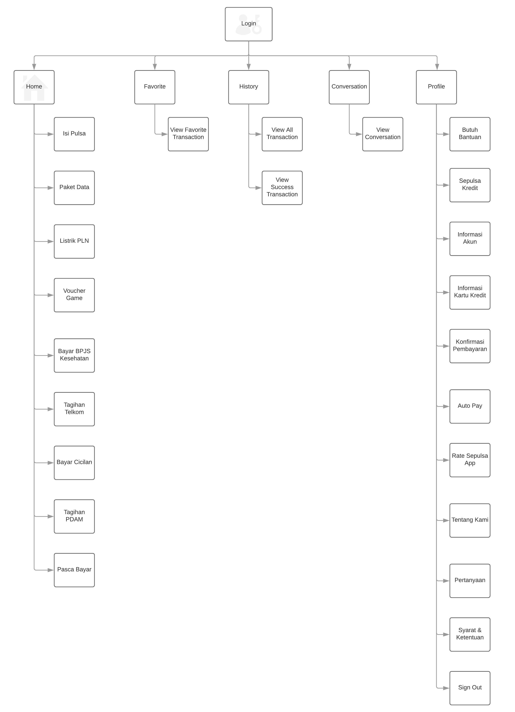

= Architecture Hermes

== High Level Architecture

Berikut merupakan gambar arsitektur sistem Hermes:

image::/ERP/Hermes/docs/images-hermes/hla-hermes.png[HLA Hermes]

Keterangan:

1. Terdapat satu (1) EC2 instance yang berisikan:
    * NGINX (web server)
2. Amazon RDS MySQL berfungsi sebagai database.

== Related System

|===
| Nama Sistem | Deskripsi

| Odoo (ERP)
| Management tool for day to day business

| Kraken
| Sistem untuk memproses transaksi pembayaran elektronik seperti Pulsa, Listrik, dll.

| Kraken 2
| Kraken 2 adalah pengembangan dari Kraken 1 yang diharapkan mampu menangani jumlah transaksi yang lebih besar, juga memiliki sistem yang lebih stabil.

| Pronghorn
| Middleware yang B2C/Sepulsa.com Frontend for B2C and API endpoint for Mobile./backend B2C
|===

== Sitemaps

Berikut merupakan sitemap dari sistem Hermes:

