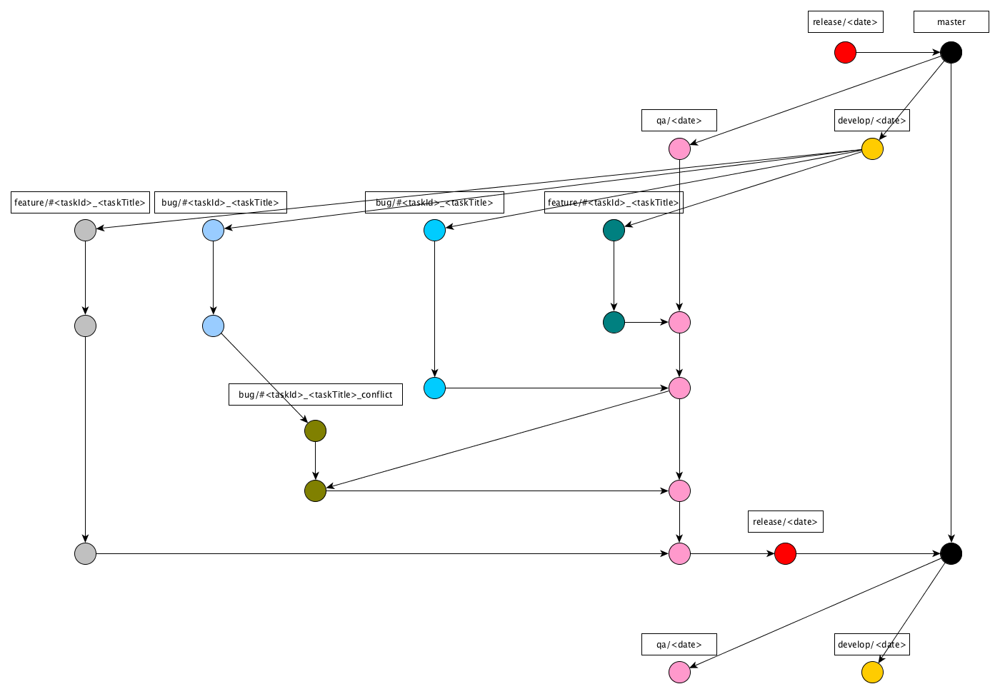
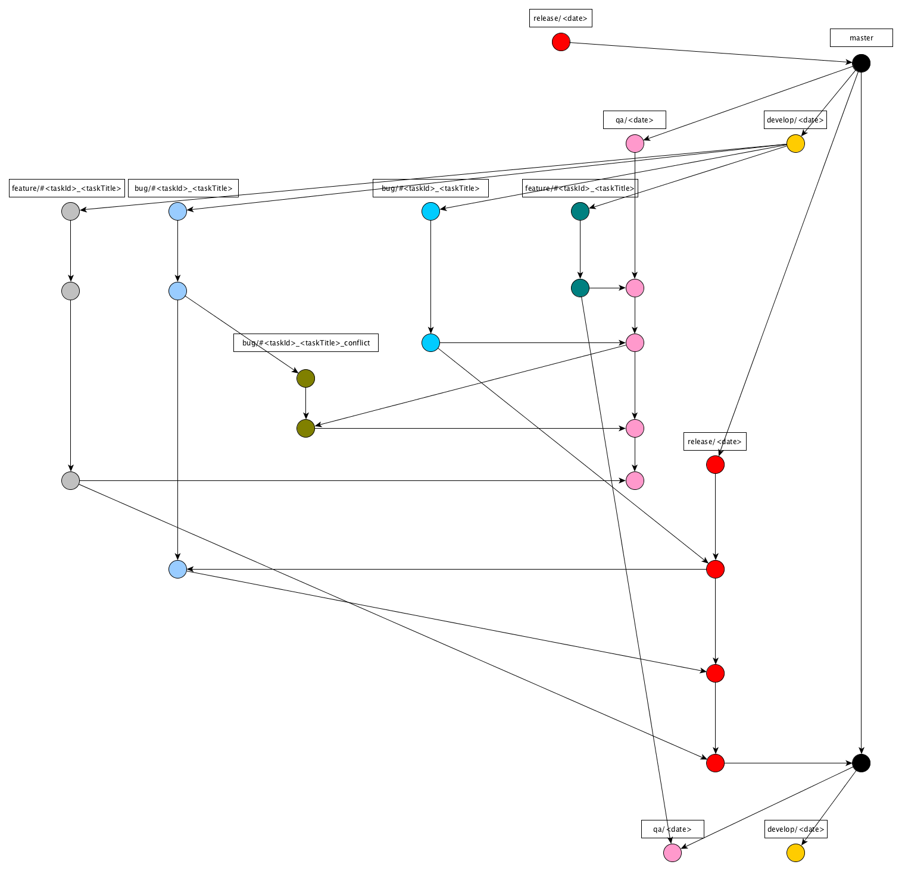

= Development Hermes

== Gitflow 

Berikut ini gitflow dari sistem Hermes dengan 2 kondisi:

* Jika semua _story_ diterima dan di-_release_:

* Jika tidak semua _story_ diterima atau tidak semua _story_ di-_release_:

== Resolve Merge Conflict

. Checkout to staging branch
. `Git pull origin` staging to ensure that local branch is up to date.
. Git pull origin branch to="" merge=""><branch>
. `Git status` to check for file conflict.
. Resolve conflict
. `Git commit -m "[Deliver#<idpivotal>]"`
. `Git push origin staging`

== Langkah-Langkah Development:

. Buat branch baru dengan nama `<pivotal_type><PivotalID><Pivotal_Title>` dari branch terakhir `dev/YYYYMMDD</Pivotal_Title></PivotalID></pivotal_type>`
. Buat Pivotal Story baru
. Push the branch which has the following format of commit message to finished story.
_Push_ branch yang telah mengikuti format _commit message_ ke _finished story_
`[Finish<PivotalID>]<PivotalTitle></PivotalTitle></PivotalID>`
. _Pull request_  ke staging
. In the event of conflict, follow the steps described in the Resolve Conflict section.
Apabila terjadi _conflict_, ikuti langkah-langkah yang telah dijelaskan pada bagian *_Resolve Conflict_* sebelumnya
. _Accept Pull Request_ dengan pesan `[DELIVER#<PivotalID>]<PivotalTitle></PivotalTitle></PivotalID>`

Hotfix Development Step:

. Create a new chore story in Pivotal by following the naming convention below:

  Hotfix xxx xxx xxx xxx

. Create a new branch from the latest master branch by following the naming convention below:
`hotfix/<PivotalID><Pivotal_Title></Pivotal_Title></PivotalID>`
. Push the branch which has the following format of commit message to finished story.
`[Finish#<PivotalID>]<PivotalTitle></PivotalTitle></PivotalID>`
. Pull Request to master branch.
. In the event of conflict, follow the steps described in the Resolve Conflict section.
