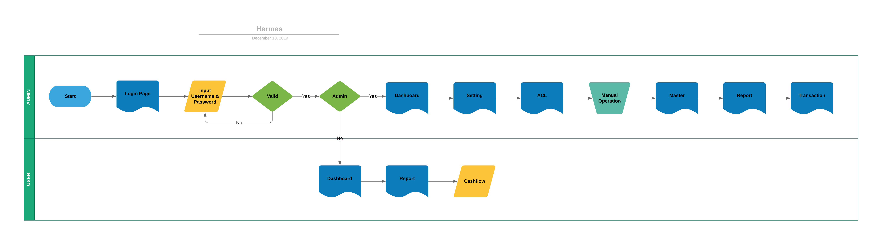

= Flow and Wireframe Hermes

== Hermes Dashboard flow

Berikut Merupakan alur atau tahapan _dasboard_ Hermes:

. User _login_ ke halaman _dasboard_ Hermes
. Masukkan _username_ dan _password_
. Jika memasukkan _username_ dan _password_ admin, gunakan halaman _dasboard_ Hermes untuk admin
. _Login_ pada halaman admin _dasboard_
. Di dalam pengaturan terdapat menu dan pengaturan sistem Hermes
. Di dalam ACL terdapat _roles_, _permission_ dan _user_
. Di dalam proses manual terdapat _Manual Cron, Recovery transaction by ID, Update Price,_ dan _Update Price by ID_
. Di dalam master terdapat _Product, Partner_ dan _Biller_
. Di dalam _report_ terdapat _cashflow_
. Di dalam transaksi terdapat _Missed Transaction Summary, Missed Transaction Detail,_ dan _Update Transaction History_
. Kembali untuk memasukkan _username_ dan _password_
. Jika memasukkan _username_ dan _password_ user, gunakan halaman _dasboard_ Hermes untuk user
. _Login_ pada halaman user _dasboard_
. Pada halaman user _dasboard_ hanya menampilkan menu laporan _cashflow_
