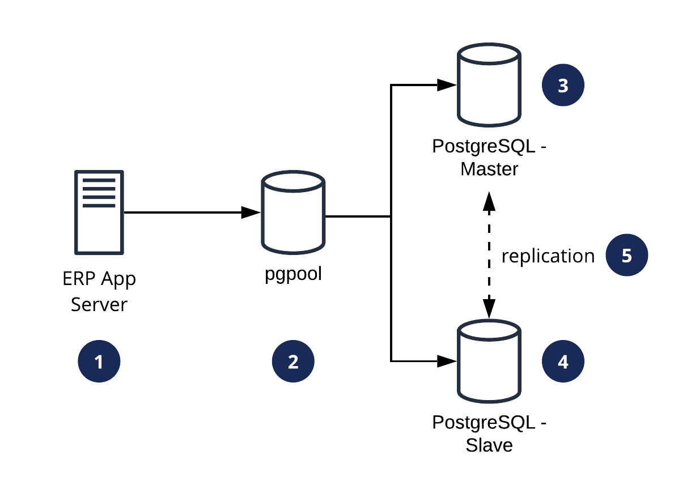

= Architecture Odoo

== Related System

|===
| System Name | Deskripsi

| Hermes
| Jembatan yang mengubah transaksi apa pun di Kraken ke ERP Odoo.

| PostgreSQL
| Basis data terpusat
|===

== High Level Architecture

*1.* *Current*

image::images-odoo/current-hla.png[Current]

Urutan berikut menjelaskan arsitektur dasar untuk sistem ERP:

. Server aplikasi ERP terhubung ke _database_ PostgreSQL secara langsung.
. _Database_ PostgreSQL akan memungkinkan lalu lintas baca / tulis dari server aplikasi ERP.

*2.* *Future*

Urutan berikut menjelaskan arsitektur dasar untuk sistem ERP:

. _Routing_ diatur dalam server aplikasi ERP.
- Operasi Baca / Tulis ke Master DB.
- Operasi baca-saja ke Slave DB.
. pgpool akan merutekan _traffic_ ke server DB yang benar.
. Master DB akan mengizinkan lalu lintas baca / tulis.
. Slave DB hanya akan mengizinkan lalu lintas baca.
. Data dari Master DB akan direplikasi ke Slave DB.
