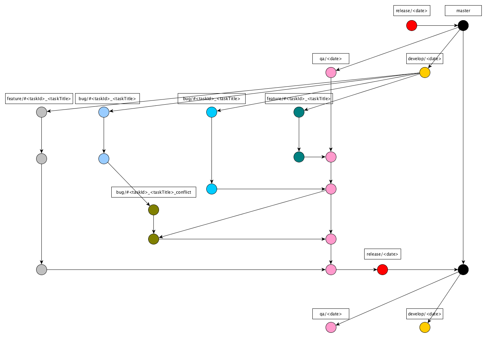
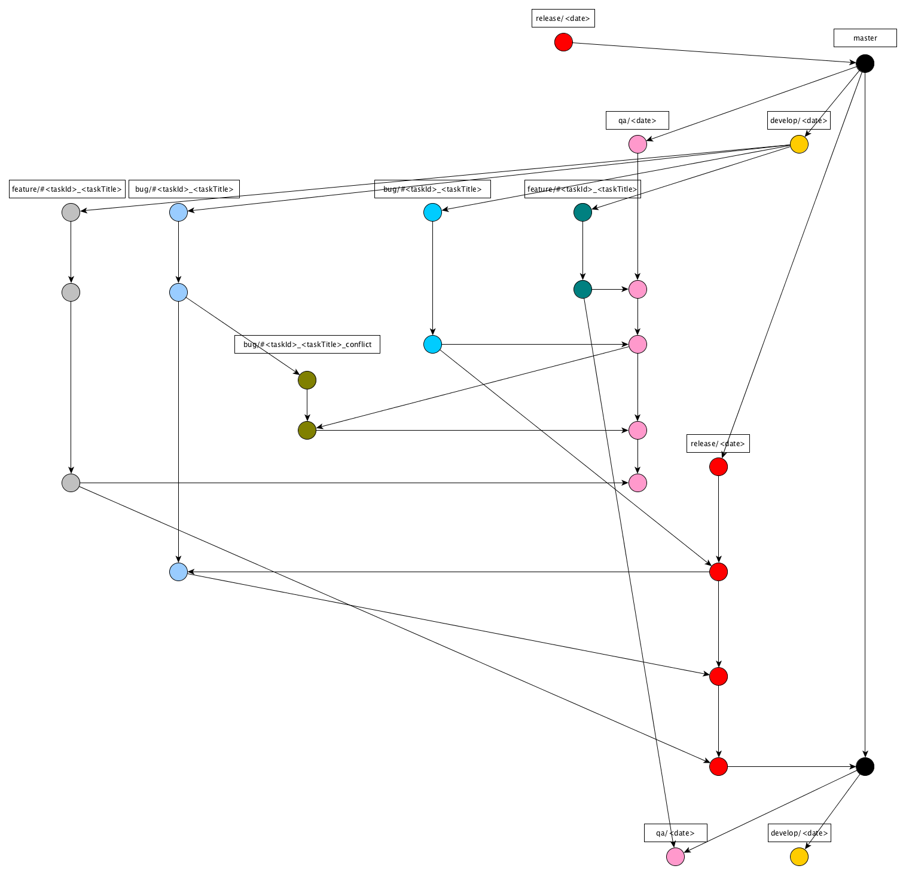

= Development Odoo

== Gitflow dari Odoo (ERP)

*A.* Bila semua Story diterima dan di-_release_:

*B.* Bila tidak semua Story diterima atau tidak semua Story di-_release_:

== Resolve Merge Conflict

. Keluar ke _staging branch_
. *Git pull _origin staging_* untuk memastikan bahwa cabang lokal up to date.
. Git pull origin `<branch to merge>`
. *Git Status* untuk memeriksa konflik file.
. Selesaikan konflik
. Git commit -m " `[Deliver#<idpivotal>]` "
. Git push origin staging

== Langkah-Langkah Development:

. Buat branch baru dengan nama `<pivotal_type>/<PivotalID>-<Pivotal_Title>` dari branch terakhir `dev/YYYYMMDD`
. Buat Pivotal Story baru
. _Push branch_ yang memiliki format pesan komit berikut hingga selesai _story_.
_Push branch_ yang telah mengikuti format _commit message_ ke _finished story_
+
`[Finish#<PivotalID>]<PivotalTitle>`
. _Pull request_  ke staging
. Jika terjadi konflik, ikuti langkah-langkah yang dijelaskan dibagian selesaikan Konflik.
Apabila terjadi _conflict_, ikuti langkah-langkah yang telah dijelaskan pada bagian *_Resolve Conflict_* sebelumnya
. _Accept Pull Request_ dengan pesan `[DELIVER#<PivotalID>] <PivotalTitle>`

== Hotfix Development Step:

. Buat _chore story_ baru di Pivotal dengan mengikuti konvensi penamaan di bawah ini:

  Hotfix xxx xxx xxx xxx

. Buat _branch_ baru dari _master branch_ terbaru dengan mengikuti konvensi penamaan di bawah ini:
+
`hotfix/<PivotalID>-<Pivotal_Title>`

. _Push branch_ yang memiliki format pesan komit berikut untuk menyelesaikan _story_.
+
`[Finish#<PivotalID>]<PivotalTitle>`

. _Pull Request_ ke _master branch_.
. Jika terjadi konflik, ikuti langkah-langkah yang dijelaskan di bagian Resolve Conflict.
