= Seingat Alicanto

== Development Team

|===
| *Name* | *Role* | *Email* 

| R Achmad Syatriadi Widisana  | Document Owner | widisana@alterra.id

| Hendrik Rahardja |  Development Manager | hendrik@alterra.id

| Ramdhan Pohan  | Product Owner | rpohan@alterra.id

a| 1. R Achmad Syatriadi Widisana  
2. Pipit Puspitasari 
| System analyst 
a| 1. widisana@alterra.id  
2. pipit@alterra.id

| Ery Hardinata | Software Engineer | ery@alterra.id

| Mugh dzin syah | Front End Developer | dzinsyah@alterra.id

| Khoiriyah | Quality Enggineer | khoiriyah@alterra.id
|===

== Overview

Sebuah sistem yang berfokus untuk mengingatkan (_reminder_) tagihan _user_. Pengingat akan berjalan sesuai dengan periode waktu yang sudah _user_ atur misalnya mingguan, bulanan, 3 bulan, 6 bulan dan tahunan. _User_ akan mendapatkan *email* pengingat berupa waktu untuk membayar tagihan, sehingga memudahkan _user_ dalam mengatur dan mempersiapkan biaya tagihan yang akan dikeluarkan untuk periode tertentu.

=== Sistem Flow
* TODO

=== User Story
Berikut merupakan cara untuk menambahkan daftar Seingat dan melakukan transaksi lewat fitur Seingat:

. _User_ masuk menu profile dan pilih menu Seingat. +
+
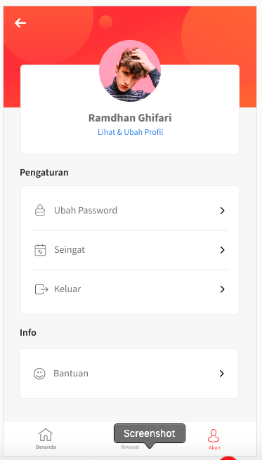

. _User_ masuk ke halaman _empty state_ jika belum memiliki _list_ Seingat. +
+
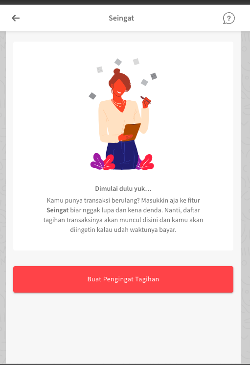

. _User_ masuk ke halaman Seingat jika memiliki _list_ seingat. +
+
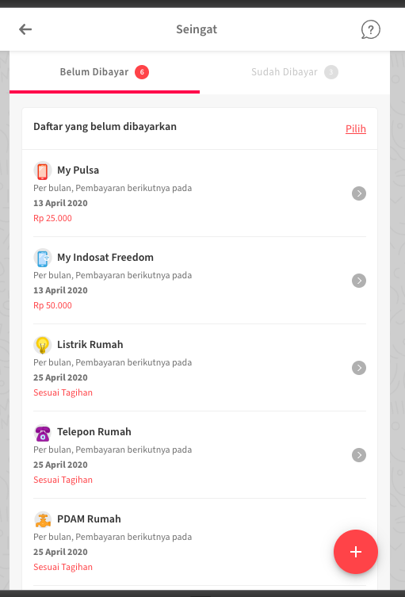

. _User_ masuk ke halaman pilih _product_, ketika klik tombol "Buat pengingat tagihan" di halaman _empty state_ atau klik tombol "+" dipojok kanan bawah halaman _list_ _seingat_. +
+
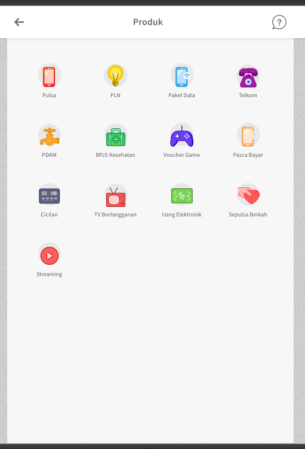

. _User_ masuk ke halaman _form_ tambah pengingat ketika klik salah satu _product_ di halaman pilih _product_. +
+
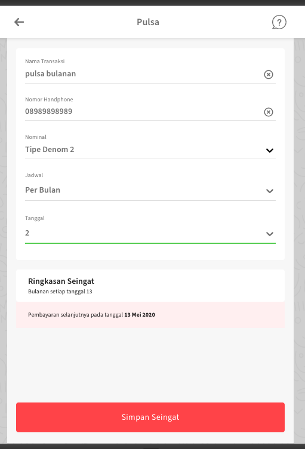

. Ketika Seingat berhasil ditambahkan maka _list_ Seingat  seperti pada gambar nomor 3 akan bertambah sesuai dengan pengingat yang di dibuat.

. _User_ akan masuk ke halaman detail Seingat ketika klik salah satu dari _product_ yang ada di _list_ Seingat (gambar nomor 3). +
+
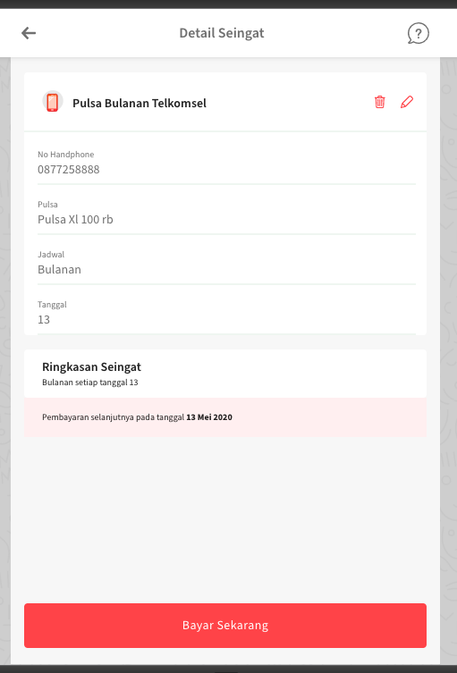

. _User_ bisa melakukan _delete_ Seingat di halaman detail Seingat dengan cara klik _icon trash_. +
+
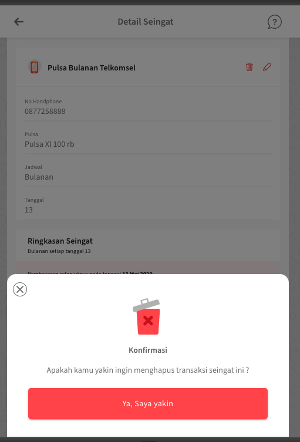

. _User_ bisa melakukan _edit_ Seingat di halaman detail Seingat dengan cara klik _icon pencil_. +
+
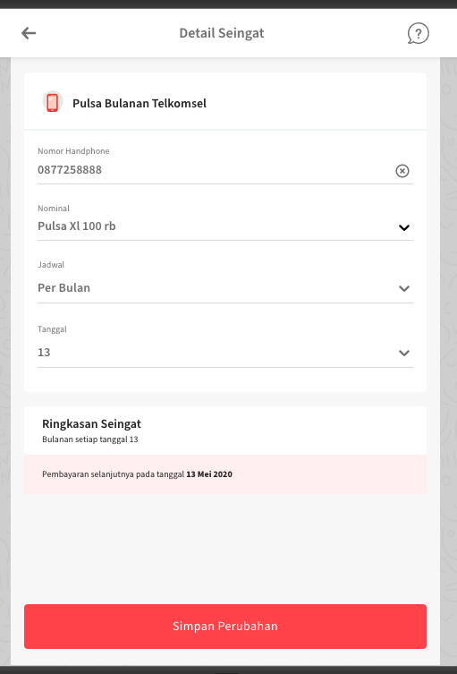

. _User_ bisa melakukan pembayaran dengan cara klik tombol bayar sekarang di halaman detail Seingat, dan akan masuk ke halaman _checkout_ (untuk product denom). +
+

. _User_ bisa mengecek jumlah tagihan dengan cara klik tombol cek tagihan di halaman seingat khusus untuk _product_ tipe _inquiry_, dan bisa langsung ke halaman _checkout_ ketika klik tombol bayar sekarang. +
+
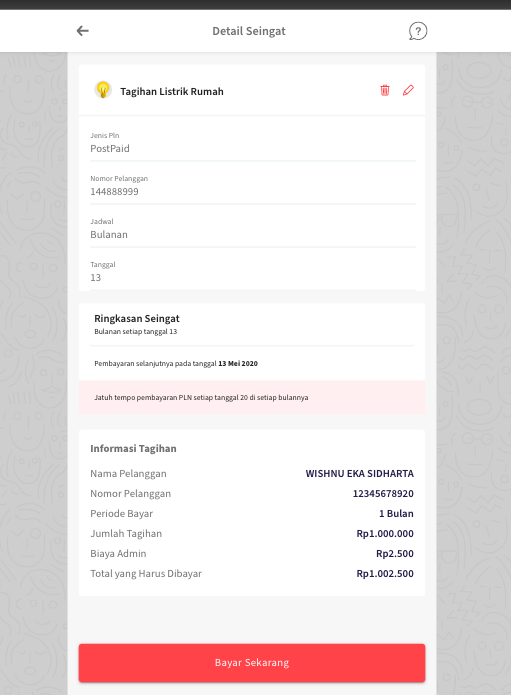

. Setelah _user_ melakukan pembayaran lewat fitur Seingat, _list_ Seingat yang sudah dibayar akan bertambah. +
+
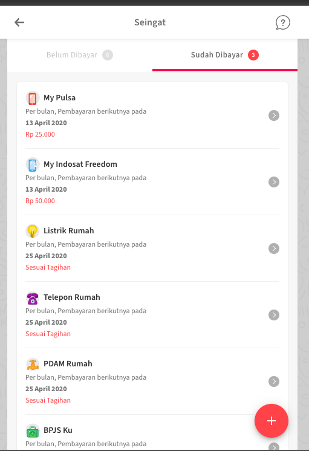

. _User_ bisa melihat detail Seingat yang sudah di bayar dengan cara klik salah satu _list_ yang ada di daftar _list_ Seingat yang sudah dibayar. +
+
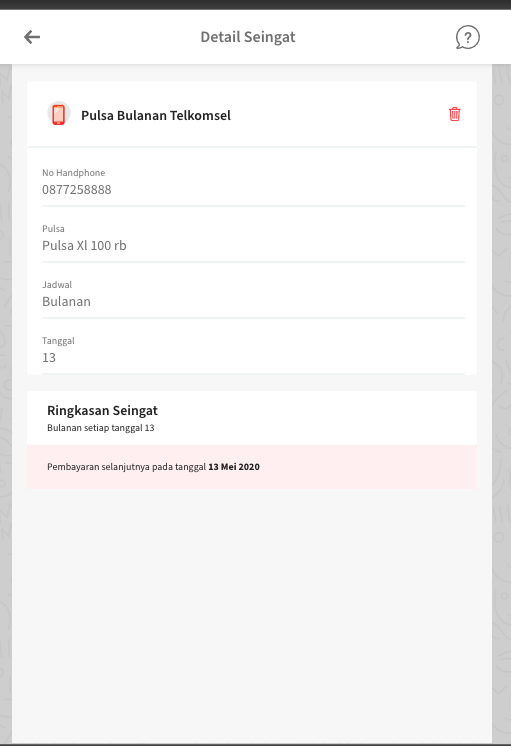

=== Implementation

==== Proses Implementasi
* Membuat mockup sesuai dengan prototype tim ui ux, url protoype nya bisa dilihat di link berikut https://xd.adobe.com/view/0c571a96-8564-4286-8e81-526a212c8ccf-5904/[link berikut].
* Integrasi dengan API yang disediakan oleh chital

==== Detail Integration
* TODO

