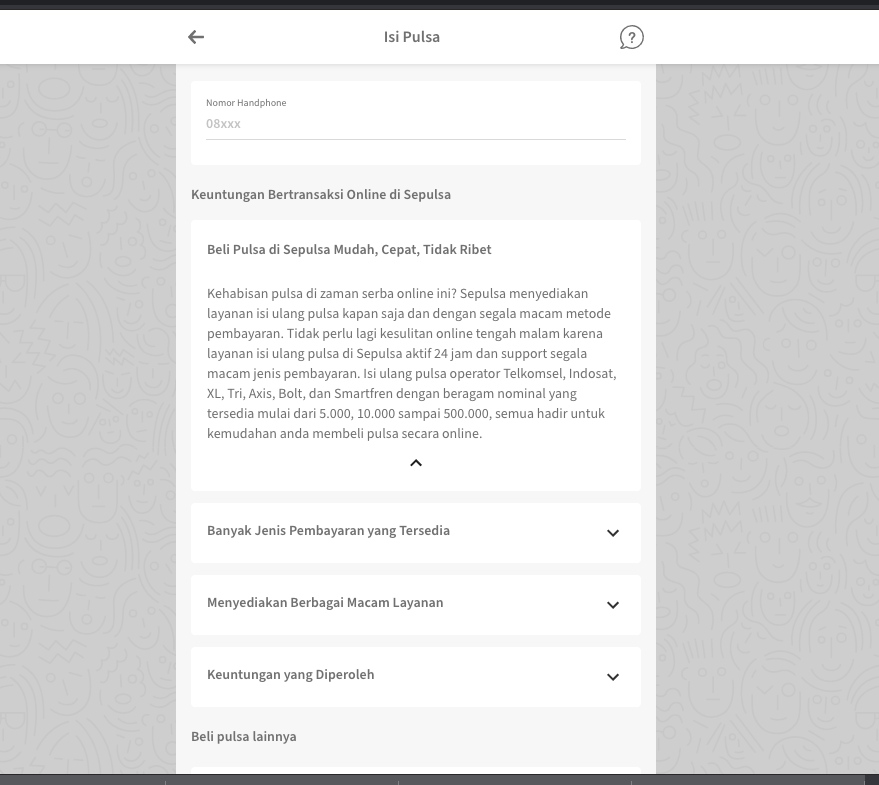
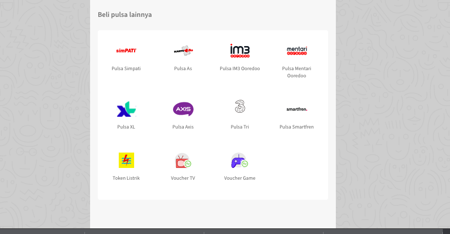

= Seingat Alicanto SEO Internal Link

== Development Team

|===
| *Name* | *Role* | *Email* 

| R Achmad Syatriadi Widisana 
| Document Owner 
| widisana@alterra.id

| Hendrik Rahardja
| Development Manager 
| hendrik@alterra.id

| Ramdhan Pohan  
| Product Owner 
| rpohan@alterra.id

a|  1. R Achmad Syatriadi Widisana  
    2. Pipit Puspitasari 
 |  System Analyst 
a|  1. widisana@alterra.id  
    2. pipit@alterra.id

| Ery Hardinata 
| Software Engineer 
| ery@alterra.id

| Mugh dzin syah 
| Front End Developer 
|dzinsyah@alterra.id

| Khoiriyah
| Quality Enggineer
| khoiriyah@alterra.id
|===

== Overview

Sebuah fitur untuk menampilkan konten-konten SEO dan link yang menuju halaman transaksi lainnya di setiap halaman transaksi, dengan tujuan meningkatkan _traffic_ web *www.sepulsa.com*.

=== Sistem Flow
* TODO

=== User Story
Berikut merupakan contoh dari konten SEO yang bisa diakses user di halaman transaksi pulsa

. _User_ membuka web *www.sepulsa.com*.

. _User_ klik pilih _product_ pulsa, dan masuk ke halaman *www.sepulsa.com/transaction/pulsa*.

. Pada halaman transaksi pulsa, _user_ dapat melihat informasi tambahan yang ada di _section_ SEO seperti gambar dibawah ini. +
+

. _User_ juga bisa pindah ke halaman transaksi produk lainnya dengan cara klik salah satu _icon_ di bawah ini. +
+

=== Implementation

==== Proses Implementasi
* Membuat _components_ baru di dalam folder _Internal-link_ dengan nama *_file Content.js_* sebagai _template_ untuk konten SEO dan *OtherProduct.js* sebagai _template_ untuk memilih produk lainnya.

* Panggil _component_ tersebut di halaman-halaman yang membutuhkan konten SEO dan _internal link_.

* Kirim _props_ dengan nama _contentSelected_ untuk data informasi yang akan ditampilkan dikomponen *Content.js* dan *otherProduct.js*.

* Data informasi yang akan ditampilkan dikumpulkan dalam satu _file_  *ContentInternalLink.js* yang terletak di _directory_ *util/ContentInternalLink.js*.

